---
## Front matter
title: "Отчет по лабораторной работе 1"
subtitle: "Установка ОС Linux"
author: "Гисматуллин Артём Вадимович НПИбд-01-22"

## Generic otions
lang: ru-RU
toc-title: "Содержание"

## Bibliography
bibliography: bib/cite.bib
csl: pandoc/csl/gost-r-7-0-5-2008-numeric.csl

## Pdf output format
toc: true # Table of contents
toc-depth: 2
lof: true # List of figures
lot: true # List of tables
fontsize: 12pt
linestretch: 1.5
papersize: a4
documentclass: scrreprt
## I18n polyglossia
polyglossia-lang:
  name: russian
  options:
	- spelling=modern
	- babelshorthands=true
polyglossia-otherlangs:
  name: english
## I18n babel
babel-lang: russian
babel-otherlangs: english
## Fonts
mainfont: PT Serif
romanfont: PT Serif
sansfont: PT Sans
monofont: PT Mono
mainfontoptions: Ligatures=TeX
romanfontoptions: Ligatures=TeX
sansfontoptions: Ligatures=TeX,Scale=MatchLowercase
monofontoptions: Scale=MatchLowercase,Scale=0.9
## Biblatex
biblatex: true
biblio-style: "gost-numeric"
biblatexoptions:
  - parentracker=true
  - backend=biber
  - hyperref=auto
  - language=auto
  - autolang=other*
  - citestyle=gost-numeric
## Pandoc-crossref LaTeX customization
figureTitle: "Рис."
tableTitle: "Таблица"
listingTitle: "Листинг"
lofTitle: "Список иллюстраций"
lotTitle: "Список таблиц"
lolTitle: "Листинги"
## Misc options
indent: true
header-includes:
  - \usepackage{indentfirst}
  - \usepackage{float} # keep figures where there are in the text
  - \floatplacement{figure}{H} # keep figures where there are in the text
---

# Цель работы

Целью данной работы является приобретение практических навыков установки операционной системы на виртуальную машину, настройки минимально необходимых для дальнейшей работы сервисов.

# Задание

1. Установить на виртуальную машину VirtualBox операционную систему Linux (дистрибутив Fedora).

2. Обновить, установить необходимые программы для более комфортной работы.

3. Настроить раскладку клавиатуры.

4. Установить программное обеспечение для создания документации.

5. Выполнить домашнее задание.

# Указания к работе

## Техническое обеспечение

- Лабораторная работа подразумевает установку на виртуальную машину VirtualBox (https://www.virtualbox.org/) операционной системы Linux (дистрибутив Fedora).
- Выполнение работы возможно как в дисплейном классе факультета физико-математических и естественных наук РУДН, так и дома. Описание выполнения работы приведено для дисплейного класса со следующими характеристиками техники:

  - Intel Core i3-550 3.2 GHz, 4 GB оперативной памяти, 80 GB свободного места на жёстком диске;
  - ОС Linux Gentoo (http://www.gentoo.ru/);
  - VirtualBox версии 7.0 или новее.

 - Для установки в виртуальную машину используется дистрибутив Linux Fedora (https://getfedora.org), вариант с менеджером окон i3 (https://spins.fedoraproject.org/i3/).
 - При выполнении лабораторной работы на своей технике вам необходимо скачать необходимый образ операционной системы

## Соглашения об наименовании

 - При выполнении работ следует придерживаться следующих правил именования:
   - Пользователь внутри виртуальной машины должен иметь имя, совпадающее с учётной записью студента, выполняющего лабораторную работу.
   - Имя хоста вашей виртуальной машины должно совпадать с учётной записью студента, выполняющего лабораторную работу.
   - Имя виртуальной машины должно совпадать с учётной записью студента, выполняющего лабораторную работу.
   - В дисплейных классах вы можете посмотреть имя вашей учётной записи, набрав в терминале команду:

        id -un

 - При установке на своей технике необходимо использовать имя вашей учётной записи дисплейных классов. Например, если студента зовут Остап Сулейманович Бендер, то его учётная запись имеет вид osbender.

# Выполнение лабораторной работы

1. Предварительно скачав необходимый образ операционной системы (так как
данная лабораторная работа выполняется на личном устройстве) и поставив
VirtualBox, я создал папку на диске D с именем «avgismatullin», куда переместил и
образ. Эта папка служит также папкой для виртуальных машин по умолчанию (рис. [-@fig:001])

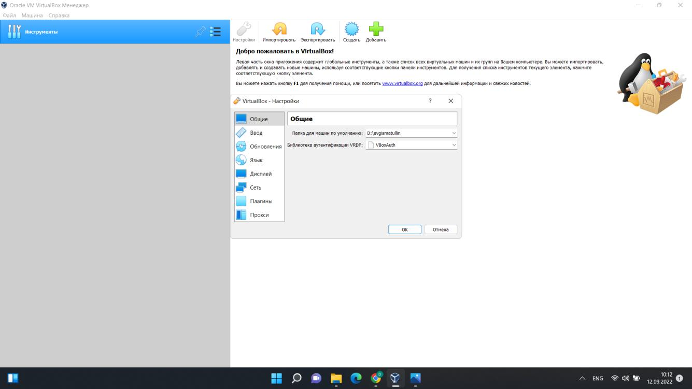{ #fig:001 width=70%, height=70% }

Более того, я поменял комбинацию для хост-клавиши, дабы освободить курсор
мыши в момент нахождения в виртуальной машине (рис. [-@fig:002]). Далее следуем
инструкции создания машины, применяем рекомендуемые параметры и приступаем к
ее установке.

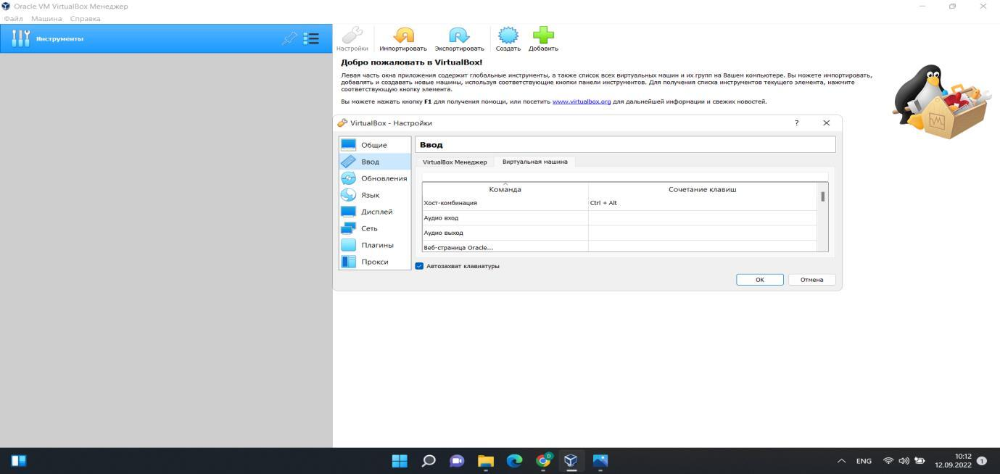{ #fig:002 width=70%, height=70% }

Устанавливаем необходимый размер основной памяти (рис. [-@fig:003]): 

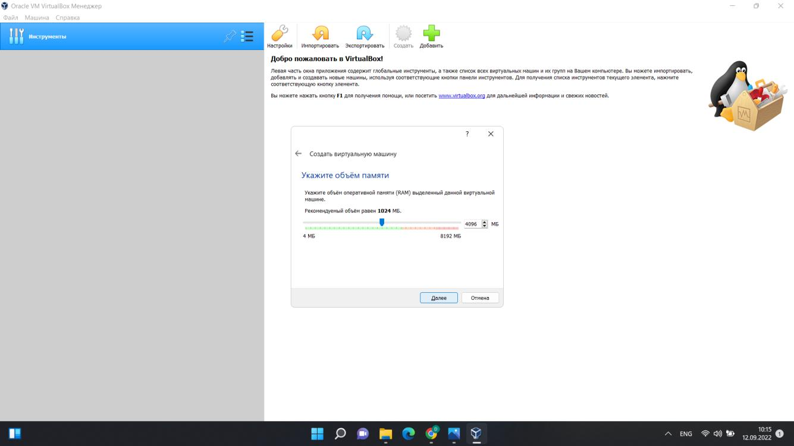{ #fig:003 width=70%, height=70% }

Указываем тип файла (рис. [-@fig:004]):

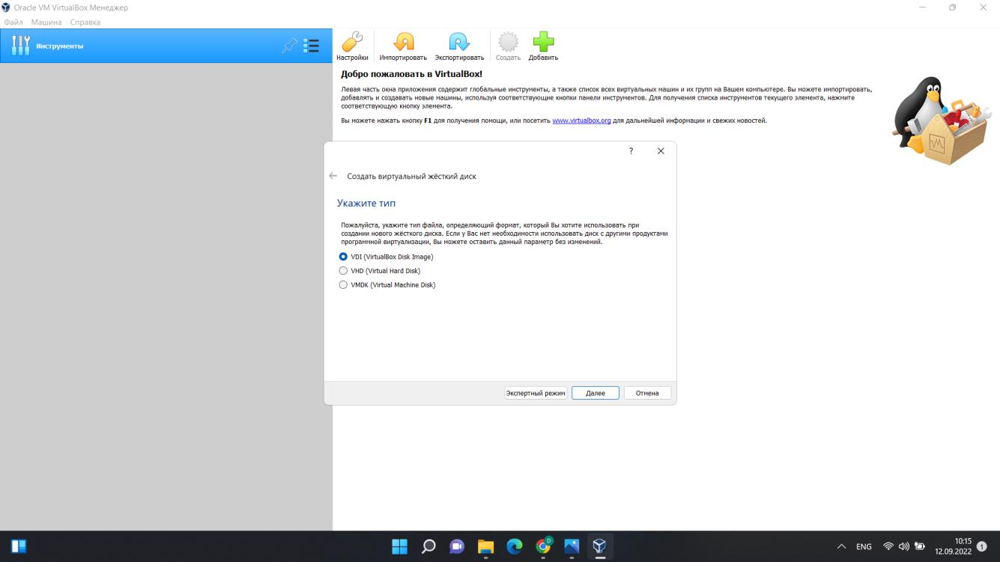{ #fig:004 width=70%, height=70% }

Выбираем нужный формат хранения (рис. [-@fig:005]):

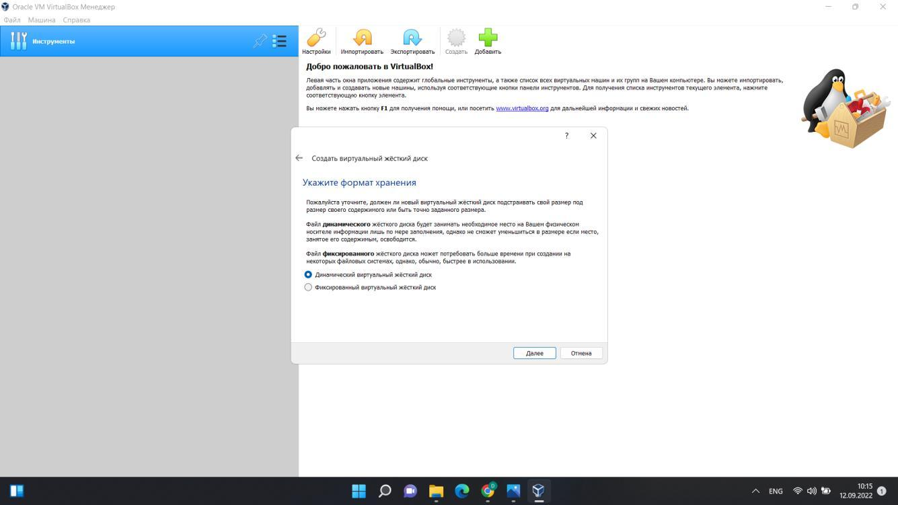{ #fig:005 width=70%, height=70% }

Далее задаем размер диска, изменяем доступный объем видеопамяти, во
вкладке «носители» применяем ранее установленный образ Fedora. В итоге
общие настройки выглядят следующим образом (рис. [-@fig:006]):

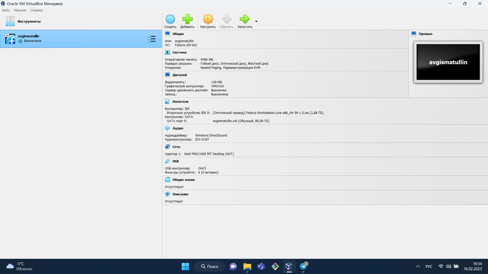{ #fig:006 width=70%, height=70% }

Следующим действием будет запуск виртуальной машины и
установка системы (рис. [-@fig:007]):

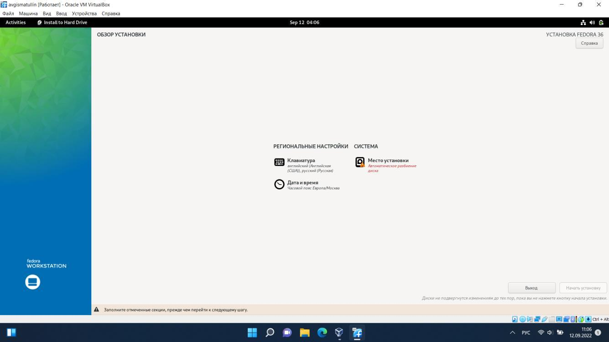{ #fig:007 width=70%, height=70% }

После завершения установки открое окно конфигурации пользователей (рис. [-@fig:008]):

{ #fig:008 width=70%, height=70% }

2. Следующим шагом будет обновление виртуальной машины, настройка операционной системы.

Обновим все пакеты (рис. [-@fig:009]):

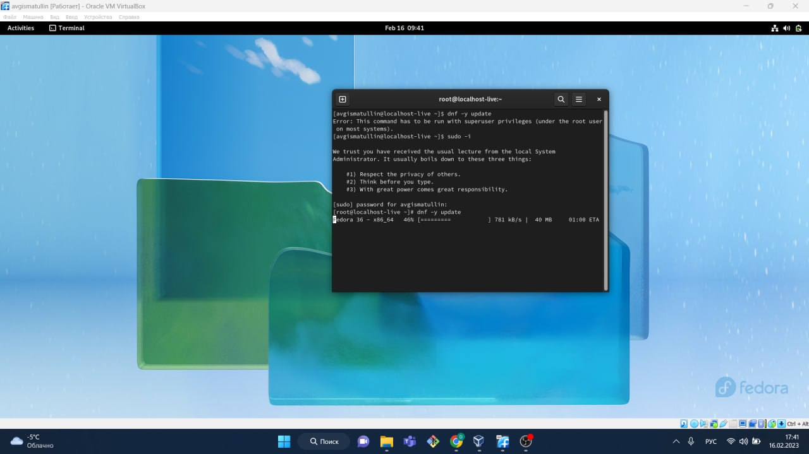{ #fig:009 width=70%, height=70% }

Установим программы для более комфортной
работы в консоли (рис. [-@fig:010]):

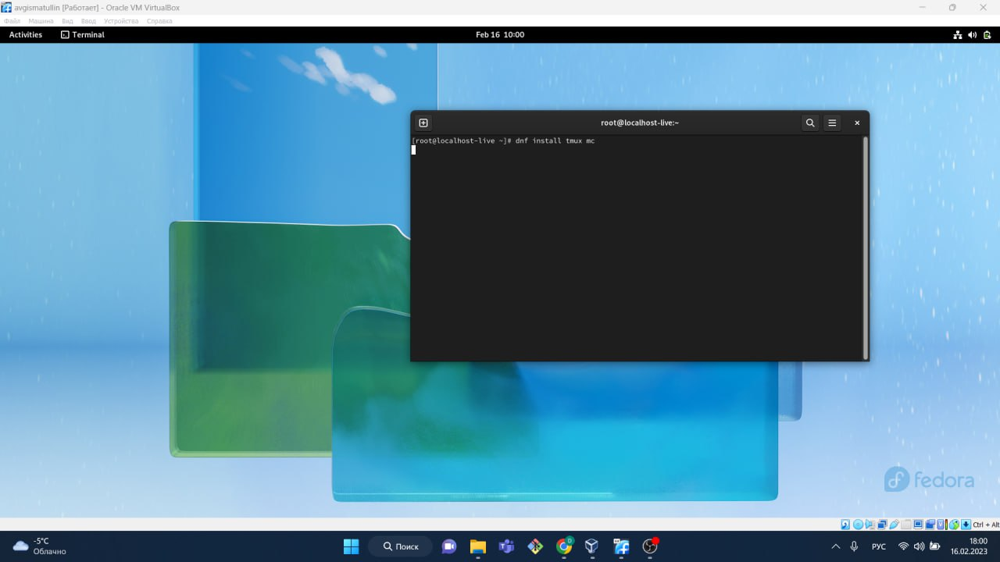{ #fig:010 width=70%, height=70% }

Установим программное обеспечение (рис. [-@fig:011]):

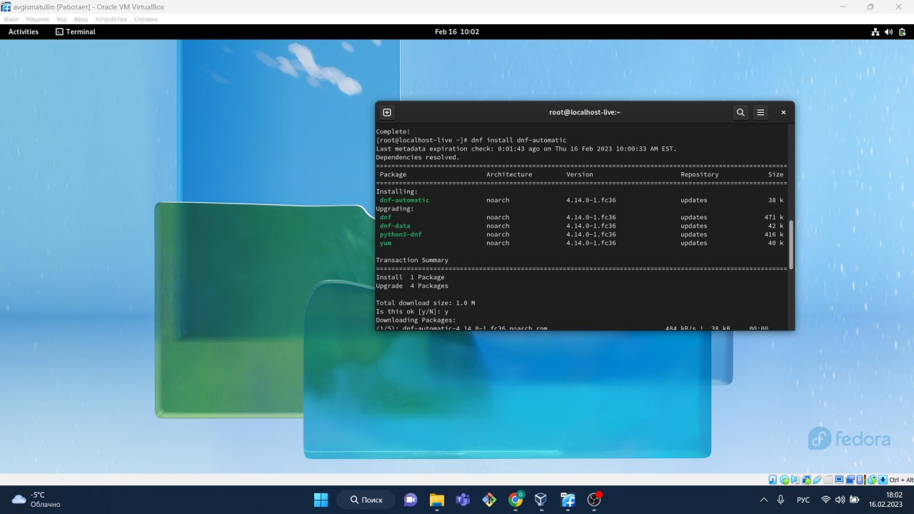{ #fig:011 width=70%, height=70% }

Зададим необходимую конфигурацию (рис. [-@fig:012]):

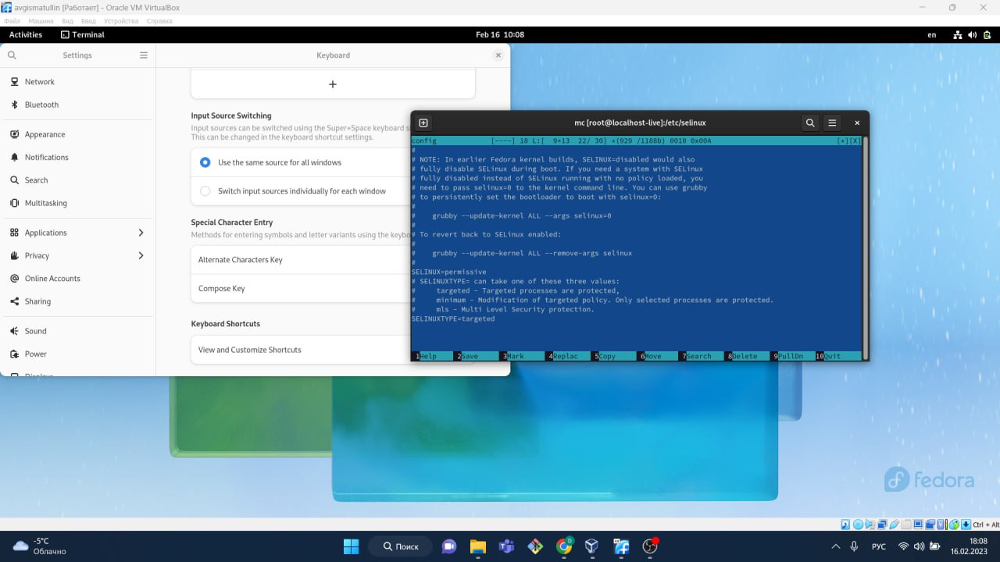{ #fig:012 width=70%, height=70% }

Установим драйвера для VirtualBox (рис. [-@fig:013]):

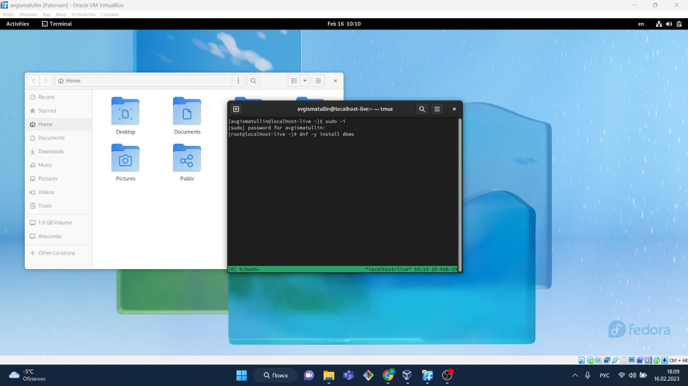{ #fig:013 width=70%, height=70% }

Так как виртуальная машина была установлена ранее (весь прошлый семестр я работал с ее помощью), поэтому такие программы, как pandoc, TeX не требуют повторной установки. Так же все необходимые настройки были проведены еще ранее.

# Выполнение домашнего задания

Суть домашней работы заключается в том, чтобы проанализировать
последовательность разгрузки системы.

Выполним следующую команду dmesg (рис. [-@fig:014]): 

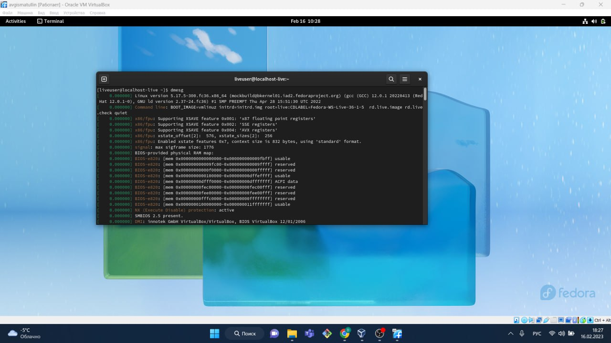{ #fig:014 width=70%, height=70% }

Посмотрим вывод (рис. [-@fig:015]):

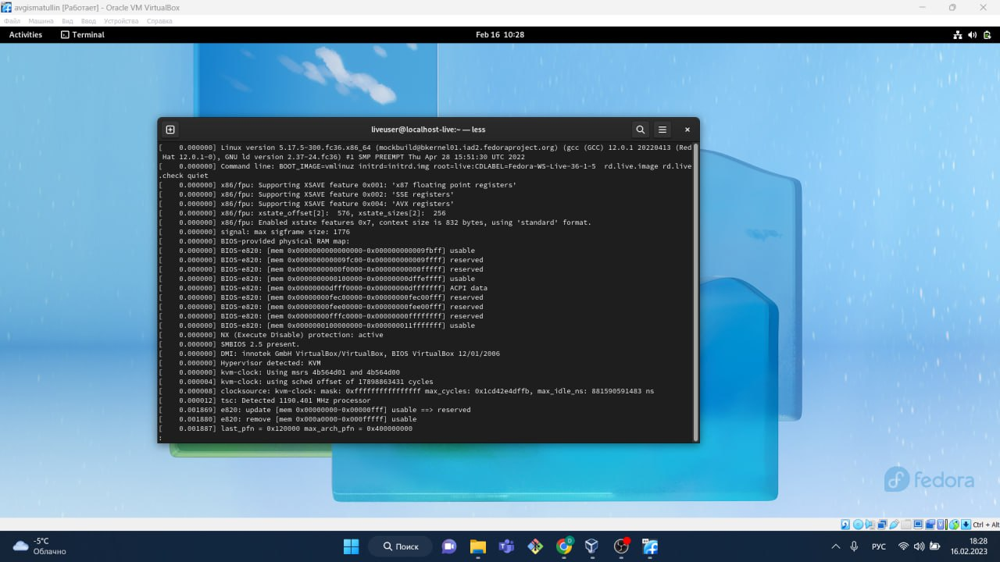{ #fig:015 width=70%, height=70% }

C помощью команды grep постараемся найти следующую информацию:

 - Версия ядра Linux (Linux version).
 - Частота процессора (Detected Mhz processor).
 - Модель процессора (CPU0).
 - Объём доступной оперативной памяти (Memory available).
 - Тип обнаруженного гипервизора (Hypervisor detected).
 - Тип файловой системы корневого раздела.
 - Последовательность монтирования файловых систем.

В результате имеем следующие данные  (рис. [-@fig:016]):

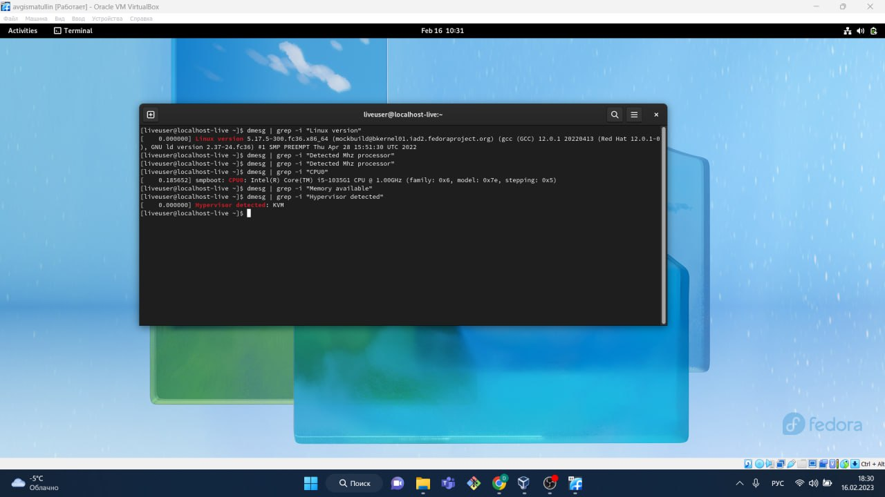{ #fig:016 width=70%, height=70% }

Также мне удалось найти тип файловой системы корневого раздела (рис. [-@fig:017]):

{ #fig:017 width=70%, height=70% }

# Выводы

В ходе работы я приобрел практические навыки установки операционной системы на виртуальную машину, настройки минимально необходимых для дальнейшей работы сервисов.

# Список литературы{.unnumbered}

::: {#refs}
:::
