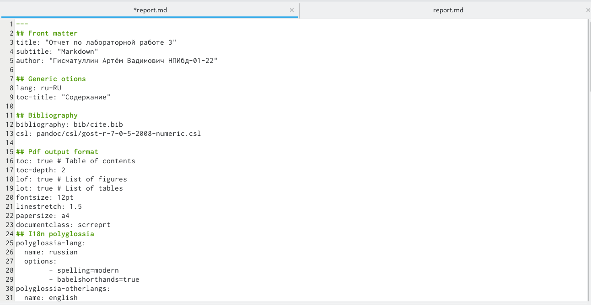
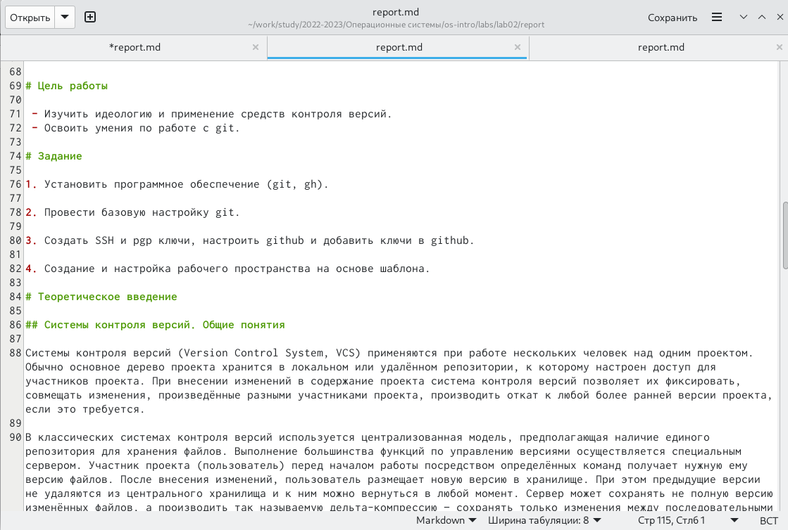
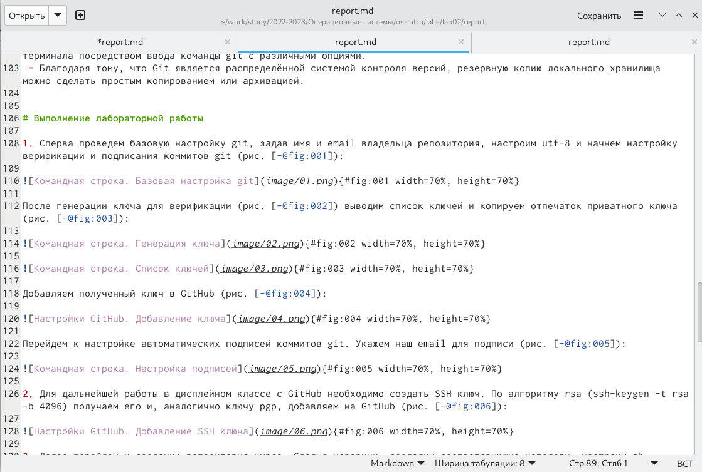
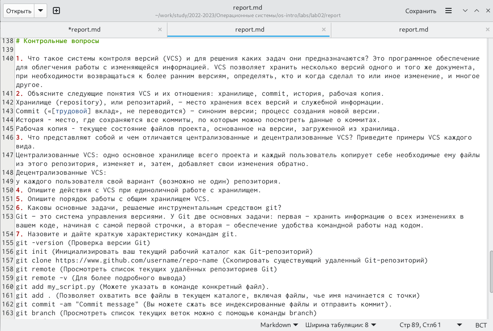
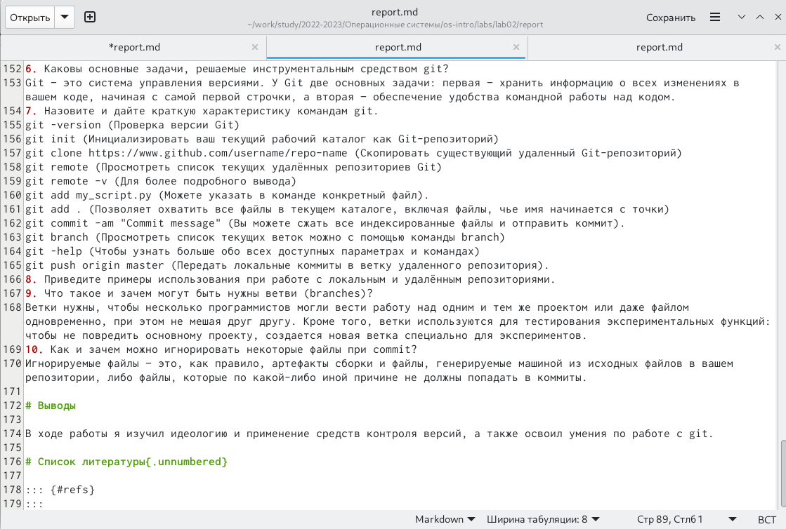
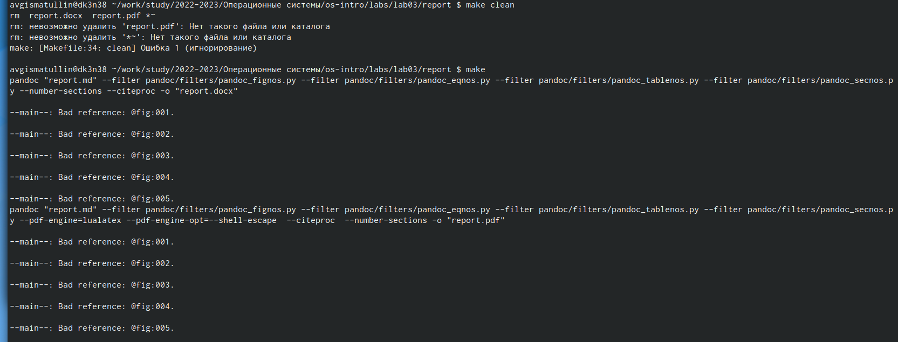

---
## Front matter
lang: ru-RU
title: Лабораторная работа № 3. Markdown.
author: |
	Гисматуллин Артём Вадимович
institute: |
	RUDN, Москва, Россия
date: 2023, 21 февраля

## i18n babel
babel-lang: russian
babel-otherlangs: english

## Formatting pdf
toc: false
toc-title: Содержание
slide_level: 2
aspectratio: 169
section-titles: true
theme: metropolis
header-includes:
 - \metroset{progressbar=frametitle,sectionpage=progressbar,numbering=fraction}
 - '\makeatletter'
 - '\beamer@ignorenonframefalse'
 - '\makeatother'
---

## Цели и задачи

- Научиться оформлять отчёты с помощью легковесного языка разметки Markdown.
- Создать отчет по лабораторной работе №2.

# Ход работы

## Оформление титульного листа

{#fig:001 width=70%, height=70%}

## Цели, задачи, теория

{#fig:002 width=70%, height=70%}

## Основная часть - выполнение работы

{#fig:003 width=70%, height=70%}

## Внимание на контрольные вопросы

{#fig:004 width=70%, height=70%}

## Выводы из выполнения работы

{#fig:005 width=70%, height=70%}

## Формирование отчетов

{#fig:006 width=70%, height=70%}

## Вывод

Успешно в ходе выполнения работы освоили процедуры оформления отчетов с помощью языка разметки Markdown.

## {.standout}

Спасибо за понимание!

