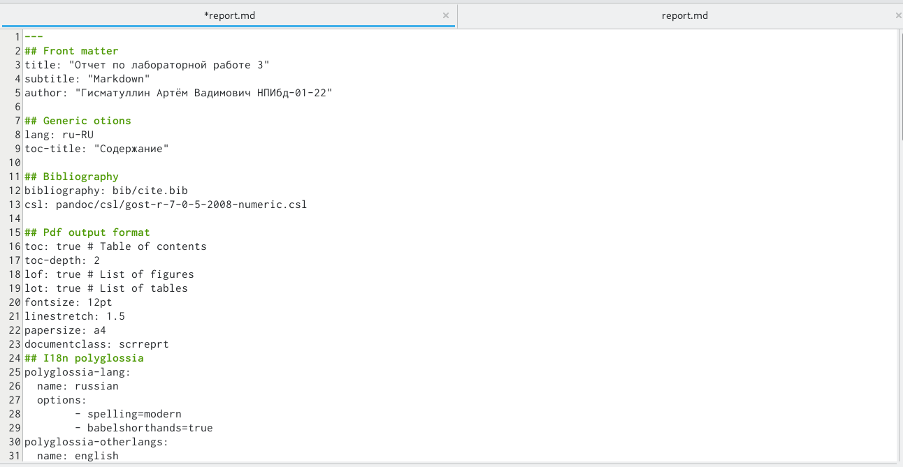
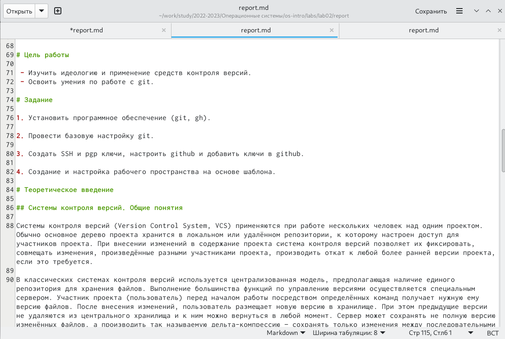
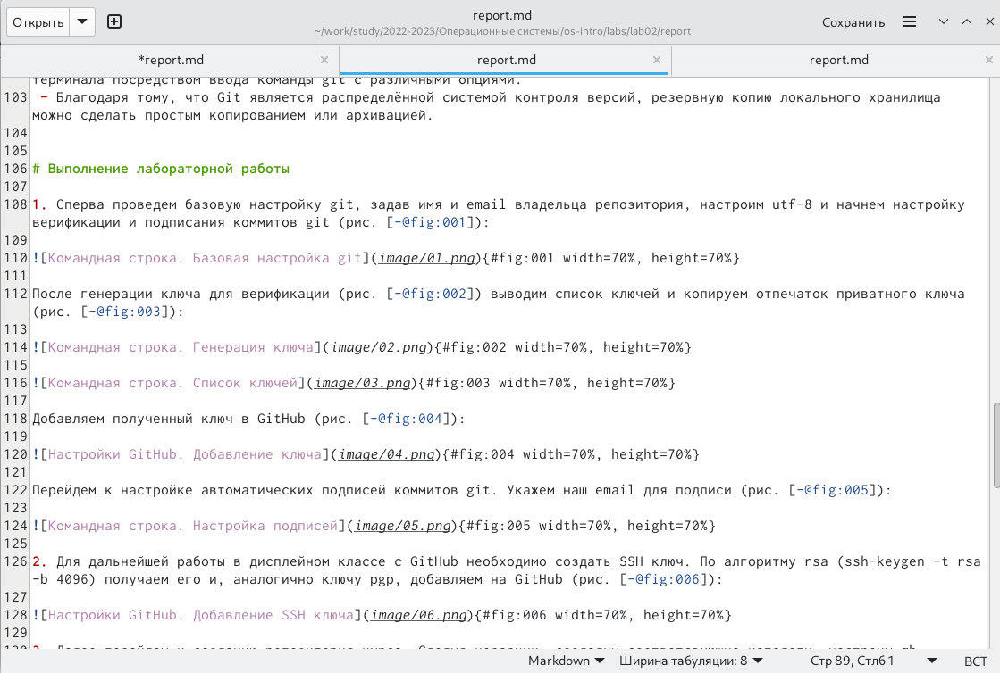
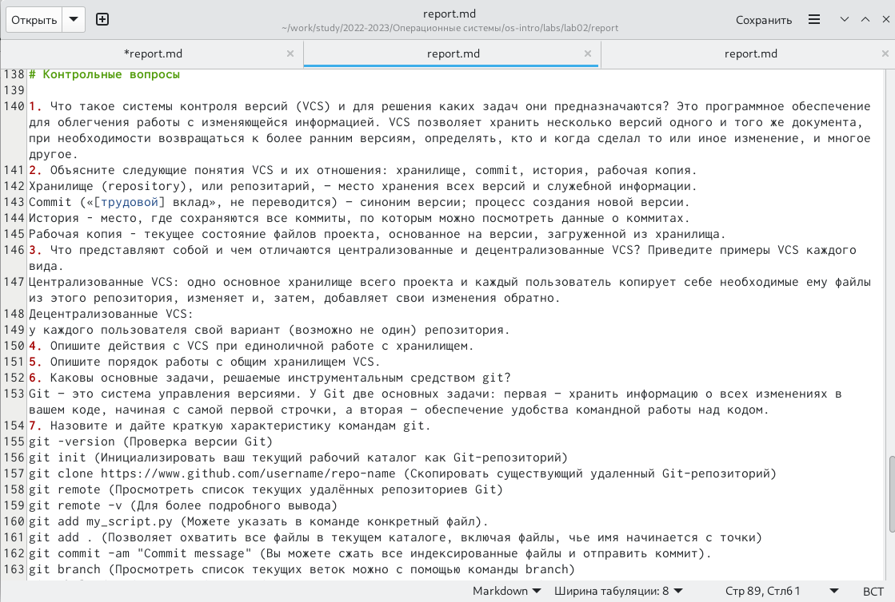
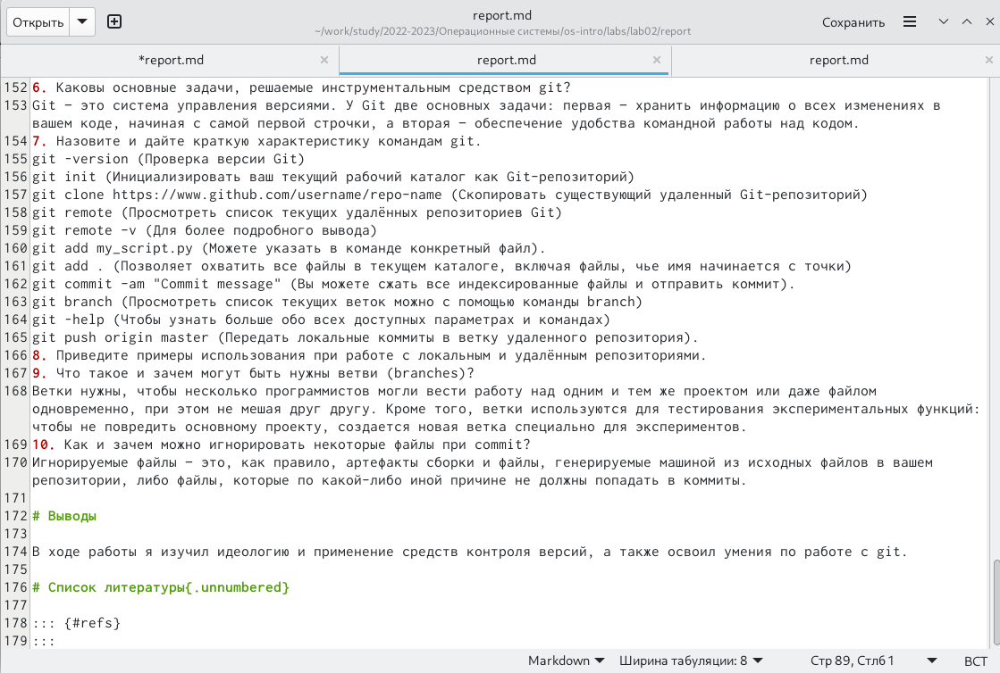
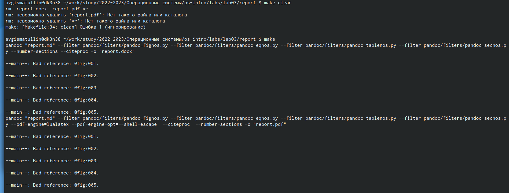

---
## Front matter
title: "Отчет по лабораторной работе 3"
subtitle: "Markdown"
author: "Гисматуллин Артём Вадимович НПИбд-01-22"

## Generic otions
lang: ru-RU
toc-title: "Содержание"

## Bibliography
bibliography: bib/cite.bib
csl: pandoc/csl/gost-r-7-0-5-2008-numeric.csl

## Pdf output format
toc: true # Table of contents
toc-depth: 2
lof: true # List of figures
lot: true # List of tables
fontsize: 12pt
linestretch: 1.5
papersize: a4
documentclass: scrreprt
## I18n polyglossia
polyglossia-lang:
  name: russian
  options:
	- spelling=modern
	- babelshorthands=true
polyglossia-otherlangs:
  name: english
## I18n babel
babel-lang: russian
babel-otherlangs: english
## Fonts
mainfont: PT Serif
romanfont: PT Serif
sansfont: PT Sans
monofont: PT Mono
mainfontoptions: Ligatures=TeX
romanfontoptions: Ligatures=TeX
sansfontoptions: Ligatures=TeX,Scale=MatchLowercase
monofontoptions: Scale=MatchLowercase,Scale=0.9
## Biblatex
biblatex: true
biblio-style: "gost-numeric"
biblatexoptions:
  - parentracker=true
  - backend=biber
  - hyperref=auto
  - language=auto
  - autolang=other*
  - citestyle=gost-numeric
## Pandoc-crossref LaTeX customization
figureTitle: "Рис."
tableTitle: "Таблица"
listingTitle: "Листинг"
lofTitle: "Список иллюстраций"
lotTitle: "Список таблиц"
lolTitle: "Листинги"
## Misc options
indent: true
header-includes:
  - \usepackage{indentfirst}
  - \usepackage{float} # keep figures where there are in the text
  - \floatplacement{figure}{H} # keep figures where there are in the text
---

# Цель работы

Научиться оформлять отчёты с помощью легковесного языка разметки Markdown.

# Задание

1. Сделать отчет по лабораторной работе №2.

2. Загрузить файлы на GitHub

# Теоретическое введение

1. Базовые сведения о Markdown

Чтобы создать заголовок, используйте знак #. Для создание подзаголовков, используте их большее количество раз.

Чтобы задать для текста полужирное начертание, заключите его в двойные
звездочки (** **):

This text is **bold**.

Чтобы задать для текста курсивное начертание, заключите его в одинарные
звездочки (* *):

This text is *italic*.

Чтобы задать для текста полужирное и курсивное начертание, заключите его
в тройные звездочки(*** ***):

This is text is both ***bold and italic***.

Блоки цитирования создаются с помощью символа >:

> The drought had lasted now for ten million years, and the reign of
the terrible lizards had long since ended. Here on the Equator,
in the continent which would one day be known as Africa, the
battle for existence had reached a new climax of ferocity, and
the victor was not yet in sight. In this barren and desiccated
land, only the small or the swift or the fierce could flourish,
or even hope to survive.

Упорядоченный список можно отформатировать с помощью соответствую-
щих цифр:

1. First instruction

	1. Sub-instruction
	
	1. Sub-instruction
	
1. Second instruction

Чтобы вложить один список в другой, добавьте отступ для элементов дочер-
него списка:

1. 	First instruction

1. 	Second instruction

1. 	Third instruction

Неупорядоченный (маркированный) список можно отформатировать с помо-
щью звездочек или тире:

* List item 1

* List item 2

* List item 3

Чтобы вложить один список в другой, добавьте отступ для элементов дочер-
него списка:

- List item 1

	- List item A

	- List item B

- List item 2

Синтаксис Markdown для встроенной ссылки состоит из части [link text],
представляющей текст гиперссылки, и части (file-name.md) – URL-адреса или
имени файла, на который дается ссылка:

[link text] (file-name.md)
или
[link text] (http://example.com/ "Необязательная подсказка") (без пробелов)

Markdown поддерживает как встраивание фрагментов кода в предложение,
так и их размещение между предложениями в виде отдельных огражденных
блоков. Огражденные блоки кода — это простой способ выделить синтаксис для
фрагментов кода. Общий формат огражденных блоков кода:

``` language
your code goes in here
```

2. Оформление формул в Markdown

Внутритекстовые формулы делаются аналогично формулам LaTeX. Например,
формула sin2(x) + cos2(x) = 1 запишется как

$\sin^2 (x) + \cos^2 (x) = 1$

Выключение формулы:

sin2(x) + cos2(x) = 1 (2.1)

со ссылкой в тексте «Смотри формулу ({-eq. 2.1}).» записывается как
$$
\sin^2 (x) + \cos^2 (x) = 1
$$ {#eq:eq1}
Смотри формулу (`[-@eq:eq1]`).

3. Оформление изображений в Markdown

В Markdown вставить изображение в документ можно с помощью непосред-
ственного указания адреса изображения.

• в квадратных скобках указывается подпись к изображению;
• в круглых скобках указывается URL-адрес или относительный путь изоб-
ражения, а также (необязательно) всплывающую подсказку, заключённую
в двойные или одиночные кавычки.
• в фигурных скобках указывается идентификатор изображения (#fig:fig1)
для ссылки на него по тексту и размер изображения относительно ширины
страницы (width=90%)


4. Обработка файлов в формате Markdown

Преобразовать файл README.md можно следующим образом:

pandoc README.md -o README.pdf

или так

pandoc README.md -o README.docx

Для компиляции отчетов рекомендуется использовать Makefile.

# Выполнение лабораторной работы

1. Оформление титульного листа. Это происходит автоматически с помощью языка разметки. Указываем номер лабораторной работы, ее название, имя студента, выполнившего ее, а также его группу (рис. [-@fig:001]):

{#fig:001 width=70%, height=70%}

2. Далее переходим к указанию цели работы, промежуточных этапов и теоретического введения в ту область, которую нам предстоит изучить в ходе работы (рис. [-@fig:002]):

{#fig:002 width=70%, height=70%}

3. Следующим шагом будет ход выполнения самой лабораторной работы: ее подробное описание, скурпулзное выполнение указанных заданий (рис. [-@fig:003]):

{#fig:003 width=70%, height=70%}

4. Неотъемлемой частью также является ответ на контрольные вопросы. Их содержание в отчете неоходимо (рис. [-@fig:004]):

{#fig:004 width=70%, height=70%}

5. Выводы, согласованные с заданием, являются последним шагом (рис. [-@fig:005]):

{#fig:005 width=70%, height=70%}

6. Наконец, формируем отчеты в pdf и docx форматах с помощью команды make (рис. [-@fig:006]):

{#fig:006 width=70%, height=70%}

# Выводы

Успешно в ходе выполнения работы освоили процедуры оформления отчетов с помощью языка разметки Markdown.

# Список литературы{.unnumbered}

::: {#refs}
:::
