---
## Front matter
lang: ru-RU
title: Лабораторная работа № 4.
subtitle: Основы интерфейса взаимодействия пользователя с системой Unix на уровне командной строки.
author: |
	Гисматуллин Артём Вадимович
institute: |
	RUDN, Москва, Россия
date: 2023, 28 февраля

## i18n babel
babel-lang: russian
babel-otherlangs: english

## Formatting pdf
toc: false
toc-title: Содержание
slide_level: 2
aspectratio: 169
section-titles: true
theme: metropolis
header-includes:
 - \metroset{progressbar=frametitle,sectionpage=progressbar,numbering=fraction}
 - '\makeatletter'
 - '\beamer@ignorenonframefalse'
 - '\makeatother'
---

## Цели и задачи

- Приобретение практических навыков взаимодействия пользователя с системой
 посредством командной строки.

# Ход работы

## Команда pwd

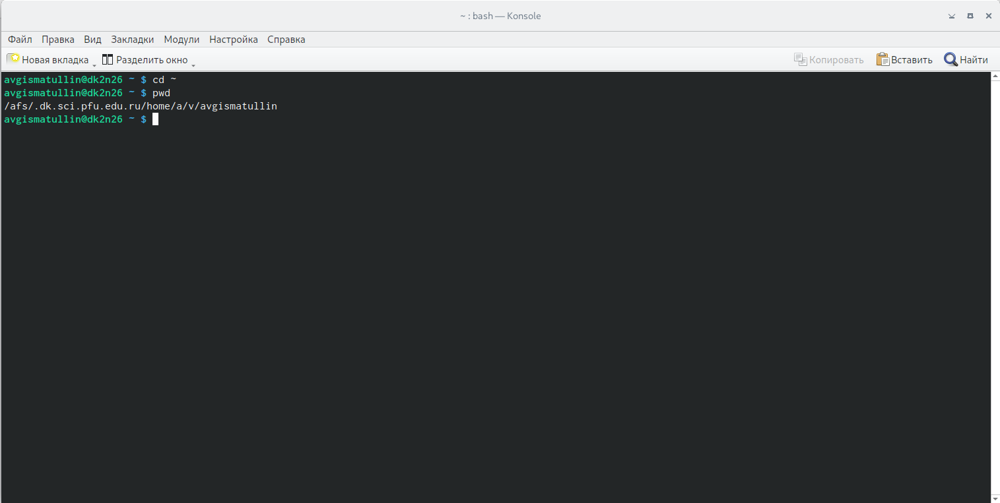{#fig:001 width=70%, height=70%}

## Команда ls в /tmp

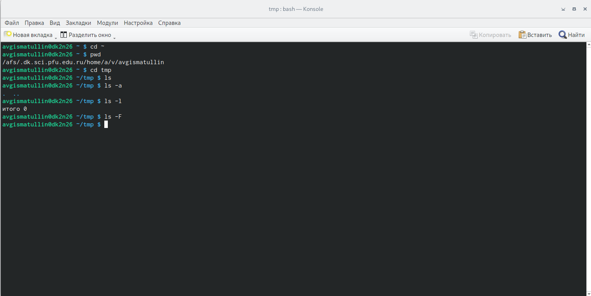{#fig:002 width=70%, height=70%}

## Поиск каталога

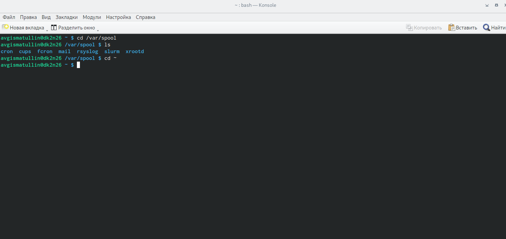{#fig:003 width=70%, height=70%}

## Получение дополнительной информации

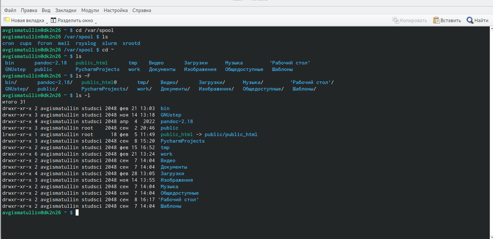{#fig:004 width=70%, height=70%}

## Создание каталогов и подкаталогов

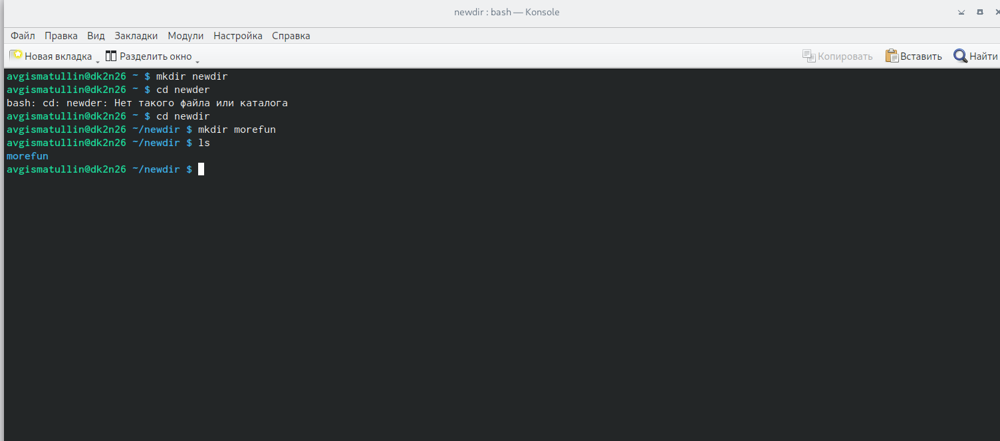{#fig:005 width=70%, height=70%}

## Создание нескольких каталогов и их удаление

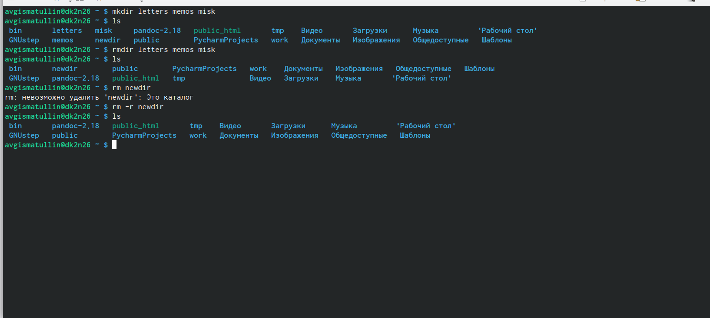{#fig:006 width=70%, height=70%}

## Больше о команде cd

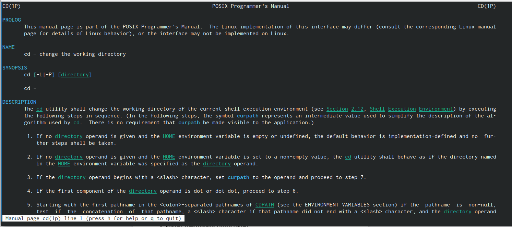{#fig:009 width=70%, height=70%}

## Подробнее о pwd 

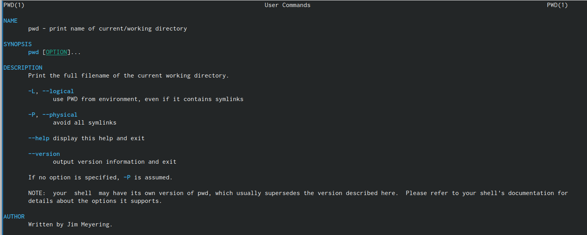{#fig:010 width=70%, height=70%}

## Дополнительно про mkdir

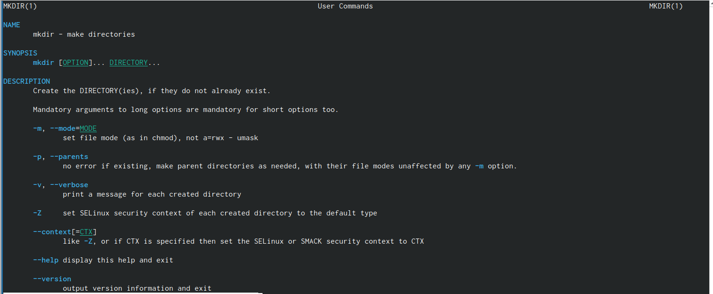{#fig:011 width=70%, height=70%}

## Больше о rmdir

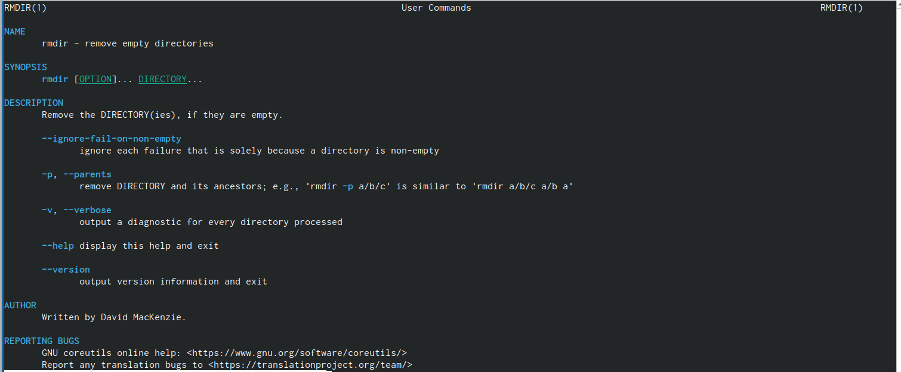{#fig:012 width=70%, height=70%}

## Дополнительно про rm

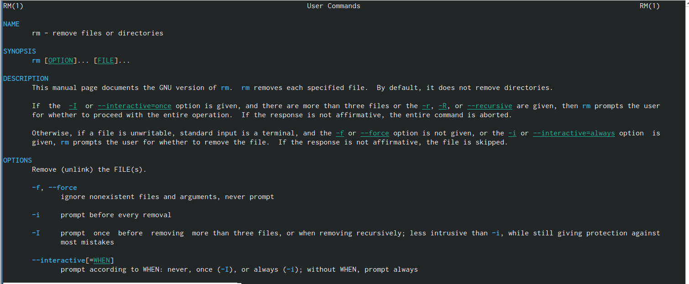{#fig:013 width=70%, height=70%}

## Команда history

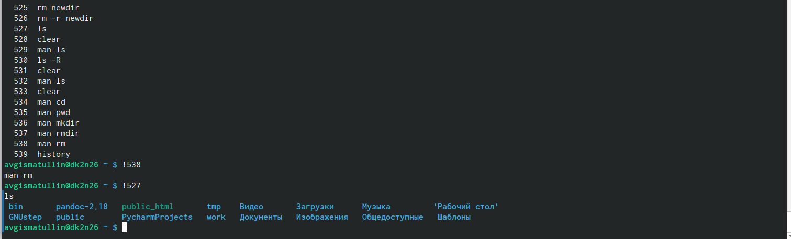{#fig:014 width=70%, height=70%}

## Вывод

В ходе выполнения лабораторной работы были приобретены практические навыки 
взаимодействия пользователя с системой посредством командной строки.

## {.standout}

Спасибо за понимание!

