---
## Front matter
title: "Отчет по лабораторной работе 4"
subtitle: "Основы интерфейса взаимодействия пользователя с системой Unix на уровне командной строки"
author: "Гисматуллин Артём Вадимович НПИбд-01-22"

## Generic otions
lang: ru-RU
toc-title: "Содержание"

## Bibliography
bibliography: bib/cite.bib
csl: pandoc/csl/gost-r-7-0-5-2008-numeric.csl

## Pdf output format
toc: true # Table of contents
toc-depth: 2
lof: true # List of figures
lot: true # List of tables
fontsize: 12pt
linestretch: 1.5
papersize: a4
documentclass: scrreprt
## I18n polyglossia
polyglossia-lang:
  name: russian
  options:
	- spelling=modern
	- babelshorthands=true
polyglossia-otherlangs:
  name: english
## I18n babel
babel-lang: russian
babel-otherlangs: english
## Fonts
mainfont: PT Serif
romanfont: PT Serif
sansfont: PT Sans
monofont: PT Mono
mainfontoptions: Ligatures=TeX
romanfontoptions: Ligatures=TeX
sansfontoptions: Ligatures=TeX,Scale=MatchLowercase
monofontoptions: Scale=MatchLowercase,Scale=0.9
## Biblatex
biblatex: true
biblio-style: "gost-numeric"
biblatexoptions:
  - parentracker=true
  - backend=biber
  - hyperref=auto
  - language=auto
  - autolang=other*
  - citestyle=gost-numeric
## Pandoc-crossref LaTeX customization
figureTitle: "Рис."
tableTitle: "Таблица"
listingTitle: "Листинг"
lofTitle: "Список иллюстраций"
lotTitle: "Список таблиц"
lolTitle: "Листинги"
## Misc options
indent: true
header-includes:
  - \usepackage{indentfirst}
  - \usepackage{float} # keep figures where there are in the text
  - \floatplacement{figure}{H} # keep figures where there are in the text
---

# Цель работы

Приобретение практических навыков взаимодействия пользователя с системой по-
средством командной строки.

# Задание

1. Определите полное имя вашего домашнего каталога. Далее относительно этого ката-
лога будут выполняться последующие упражнения.

2. Выполните следующие действия:
	2.1. Перейдите в каталог /tmp.
	
	2.2. Выведите на экран содержимое каталога /tmp. Для этого используйте команду ls
	     с различными опциями. Поясните разницу в выводимой на экран информации.
	     
	2.3. Определите, есть ли в каталоге /var/spool подкаталог с именем cron?
	
	2.4. Перейдите в Ваш домашний каталог и выведите на экран его содержимое. Опре-
	     делите, кто является владельцем файлов и подкаталогов?
	     
3. Выполните следующие действия:
	3.1. В домашнем каталоге создайте новый каталог с именем newdir.
	
	3.2. В каталоге ~/newdir создайте новый каталог с именем morefun.
	
	3.3. В домашнем каталоге создайте одной командой три новых каталога с именами
	     letters, memos, misk. Затем удалите эти каталоги одной командой.
	     
	3.4. Попробуйте удалить ранее созданный каталог ~/newdir командой rm. Проверьте,
	     был ли каталог удалён.
	     
	3.5. Удалите каталог ~/newdir/morefun из домашнего каталога. Проверьте, был ли
	     каталог удалён.
	     
4. С помощью команды man определите, какую опцию команды ls нужно использо-
вать для просмотра содержимое не только указанного каталога, но и подкаталогов,
входящих в него.

5. С помощью команды man определите набор опций команды ls, позволяющий отсорти-
ровать по времени последнего изменения выводимый список содержимого каталога
с развёрнутым описанием файлов.

6. Используйте команду man для просмотра описания следующих команд: cd, pwd, mkdir,
rmdir, rm. Поясните основные опции этих команд.

7. Используя информацию, полученную при помощи команды history, выполните мо-
дификацию и исполнение нескольких команд из буфера команд

# Теоретическое введение

В операционной системе типа Linux взаимодействие пользователя с системой обычно
осуществляется с помощью командной строки посредством построчного ввода команд. 
При этом обычно используется командные интерпретаторы языка shell: /bin/sh;
/bin/csh; /bin/ksh.
Формат команды. Командой в операционной системе называется записанный по
специальным правилам текст (возможно с аргументами), представляющий собой указание на 
выполнение какой-либо функций (или действий) в операционной системе.
Обычно первым словом идёт имя команды, остальной текст — аргументы или опции,
конкретизирующие действие.
Общий формат команд можно представить следующим образом:
<имя_команды><разделитель><аргументы>

# Выполнение лабораторной работы

1. Начнем с определения полного имени домашнего каталога. Это можно сделать с помощью команды pwd (рис. @fig:001).

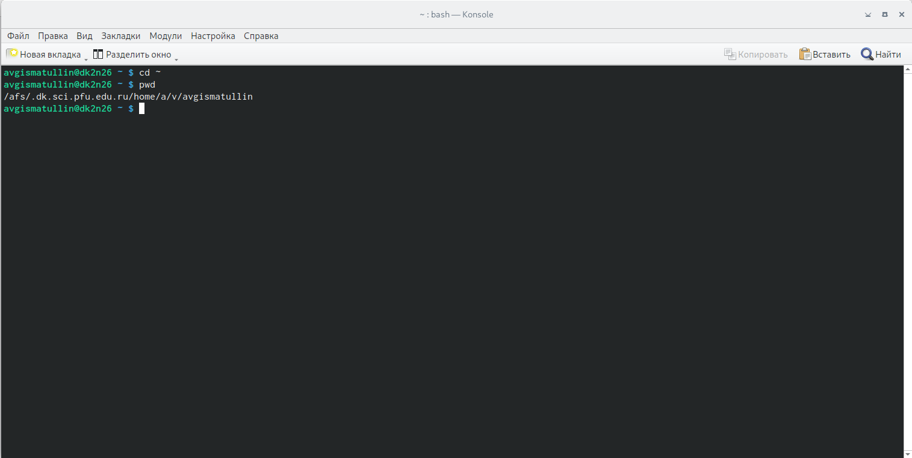{#fig:001 width=70%, height=70%}

Затем переходим в каталог tmp и выполняем команду ls с различными ключами (рис. @fig:002).

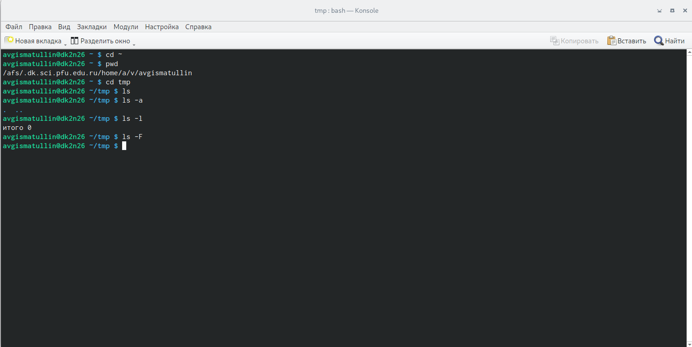{#fig:002 width=70%, height=70%}

ls - вывод содержимого каталога, ls -a - вывод скрытых файлов, ls -l - вывод более подробной информации о файлах,
ls -F - вывод информации о скрытых файлах. К сожалению, данный каталог пустой, но команды успешно работают.

Далее ищем каталог cron по адресу /var/spool. Убеждаемся, что он присутствует (рис. @fig:003).

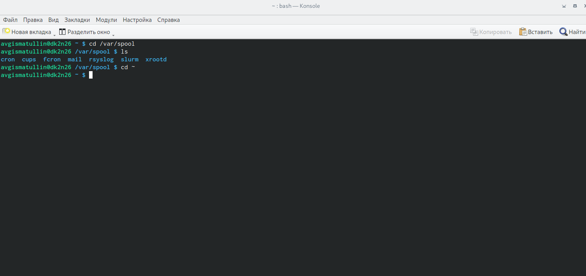{#fig:003 width=70%, height=70%}

В конце выполнения задания 2 необходимо определить владельца файлов домашнего каталога. Для этого воспользуемся
командой ls -l для получения более подробной информации (рис. @fig:004).

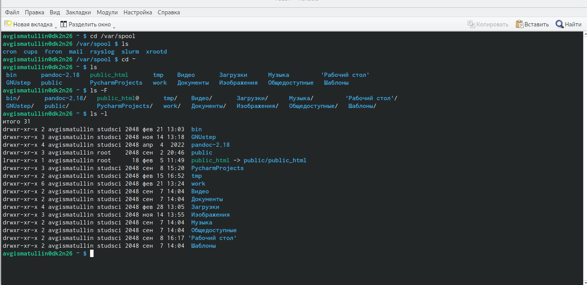{#fig:004 width=70%, height=70%}

2. Создадим каталог newdir в домашнем каталоге с помощью команды newdir, перейдем в него и там
создадим новый каталог с именем morefun (рис. @fig:005):

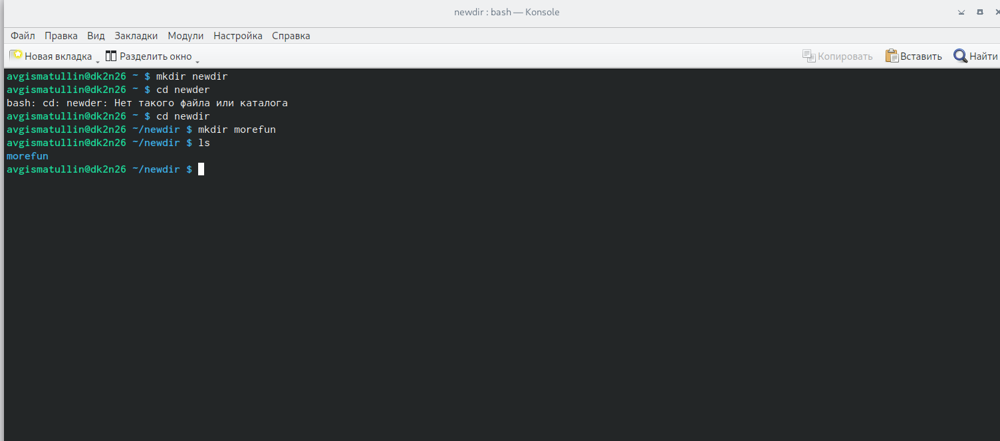{#fig:005 width=70%, height=70%}

Вернемся в домашний каталог, создадим три новых каталога letters, memos, misk и попытаемся удалить newdir (рис. @fig:005):

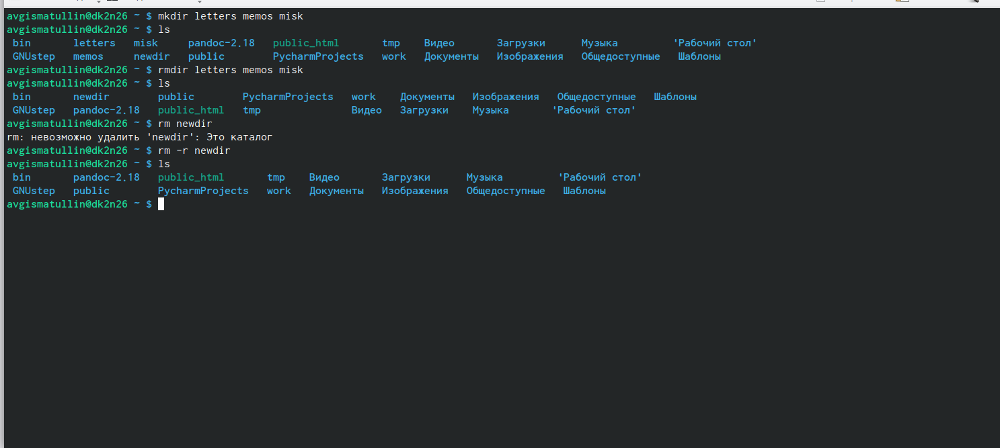{#fig:006 width=70%, height=70%}

Здесь можно заметить, что просто командой rm удалить каталог newdir не удается. Это вызвано тем,
что внутри него есть еще каталог morefun. Для осуществления удаления необходимо сделать это рекурсивно,
с ключом -r.

3. C помощью команды man ls найдем ключ, позволяющий выводить не только каталоги, но и подкаталоги (рис. @fig:007):

{#fig:007 width=70%, height=70%}

Из описания мы понимаем, что это ключ -R.

Далее ищем ключ, позволяющий отсортировывать по времени изменения файлов. За это отвечает ключ -с (рис. @fig:008):

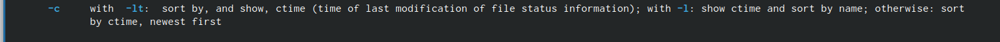{#fig:008 width=70%, height=70%}

Подробнее о командах cd, mkdir, rm, rmdir, pwd:

man cd позволяет узнать больше о команде cd (рис. @fig:009):

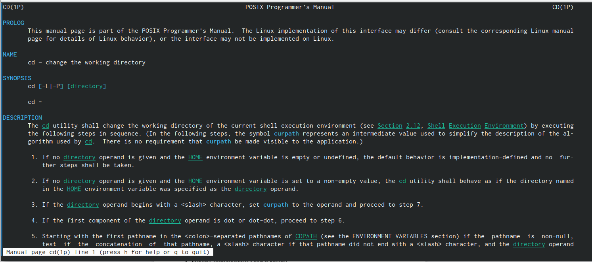{#fig:009 width=70%, height=70%}

Эта команда отвечает за перемещение по файлам посредством командной строки.

pwd выводит на экран полный адрес рабочей директории (рис. @fig:0010):

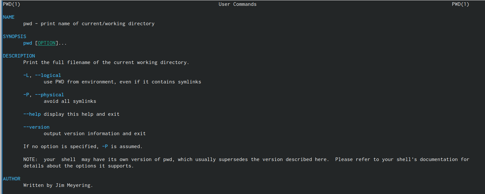{#fig:010 width=70%, height=70%}

mkdir отвечает за создание новых директорий (рис. @fig:011):

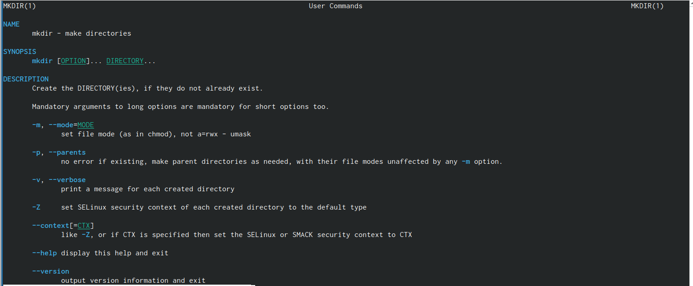{#fig:011 width=70%, height=70%}

rmdir отвечает за удаление пустых директорий (рис. @fig:012):

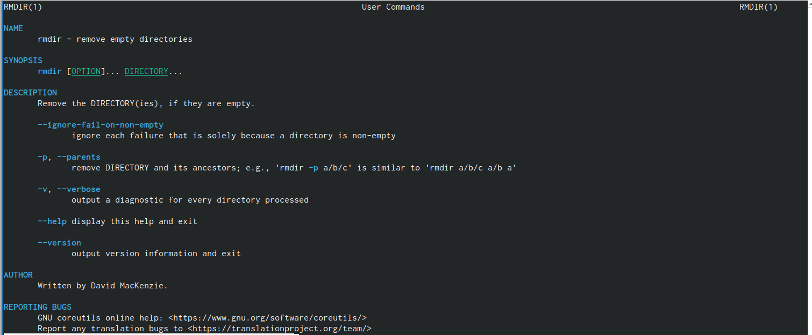{#fig:012 width=70%, height=70%}

rm удаляет уже не только директории, но и файлы (рис. @fig:013):

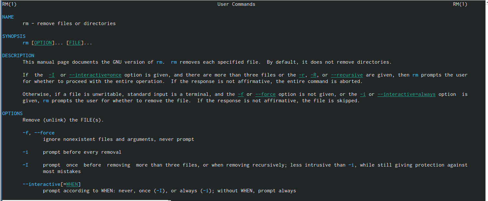{#fig:013 width=70%, height=70%}

4. При помощи команды history мы можем узнать подробнее о предыдущих командах. А уже, выполнив !n, где
n - номер соответствующей команды, мы можем повторить ранее выполненное действие (рис. @fig:014):

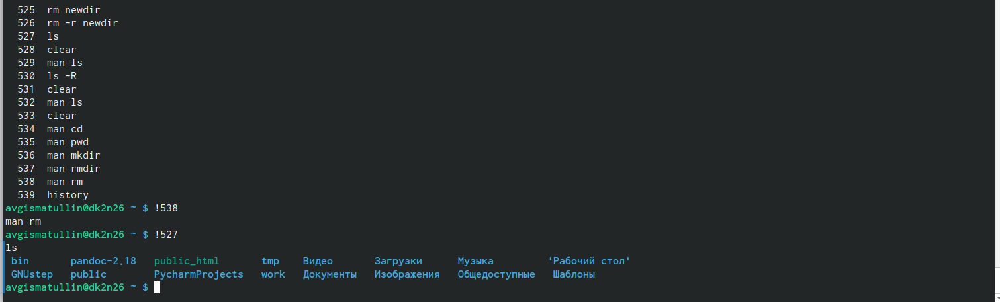{#fig:014 width=70%, height=70%}

# Контрольные вопросы

1. Что такое командная строка? Терминал Linux предоставляет интерфейс, в котором можно вводить команды и видеть результат, напечатанный в виде текста. Можно использовать терминал для выполнения таких задач, как перемещение файлов или навигация по каталогу, без использования графического интерфейса.

2. При помощи какой команды можно определить абсолютный путь текущего каталога? Приведите пример. При помощи команды pwd. 

3. При помощи какой команды и каких опций можно определить только тип файлов и их имена в текущем каталоге? Приведите примеры. ls -F.

4. Каким образом отобразить информацию о скрытых файлах? Приведите примеры. Для того, чтобы отобразить имена скрытых файлов, необходимо использовать команду ls с опцией a.

5. При помощи каких команд можно удалить файл и каталог? Можно ли это сделать одной и той же командой? Приведите примеры. rmdir и rm.

6. Каким образом можно вывести информацию о последних выполненных пользователем командах? работы?

7. Как воспользоваться историей команд для их модифицированного выполнения? Приведите примеры. С помощью команды history.

8. Приведите примеры запуска нескольких команд в одной строке. 

9. Дайте определение и приведите примера символов экранирования. Экранирование символов — замена в тексте управляющих символов на соответствующие текстовые подстановки.
10. Охарактеризуйте вывод информации на экран после выполнения команды ls с опцией l. Чтобы вывести на экран подробную информацию о файлах и каталогах, необходимо использовать опцию l. При этом о каждом файле и каталоге будет выведена следующая информация: тип файла, право доступа, число ссылок, владелец, размер, дата последней ревизии, имя файла или каталога.

11. Что такое относительный путь к файлу? Приведите примеры использования относительного и абсолютного пути при выполнении какой-либо команды. Относительный путь представляет собой путь по отношению к текущему рабочему каталогу пользователя или активных приложений. 

12. Как получить информацию об интересующей вас команде? При помощи команды man.

13. Какая клавиша или комбинация клавиш служит для автоматического дополнения вводимых команд? Tab.

# Выводы

В ходе выполнения лабораторной работы были приобретены практические навыки взаимодействия пользователя с системой посредством командной строки.

# Список литературы{.unnumbered}

::: {#refs}
:::
