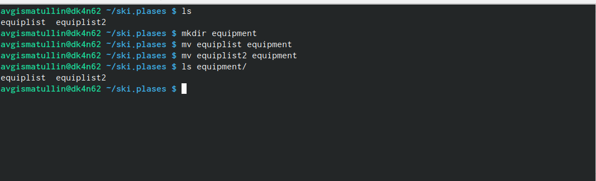
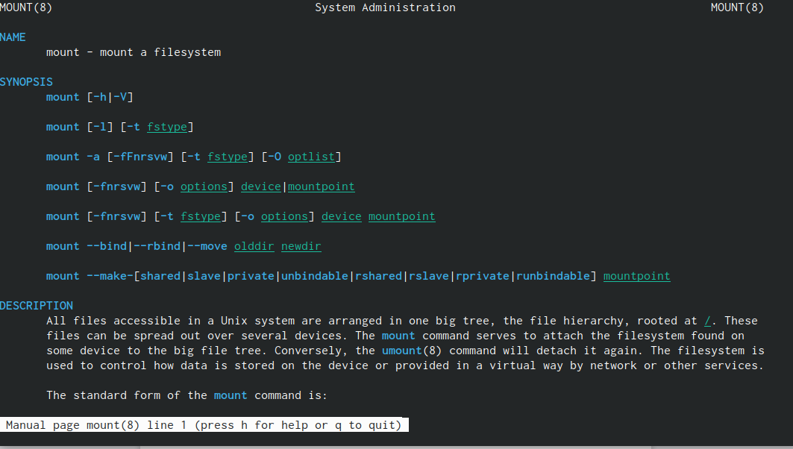

---
## Front matter
lang: ru-RU
title: Лабораторная работа № 4.
subtitle: Основы интерфейса взаимодействия пользователя с системой Unix на уровне командной строки.
author: |
	Гисматуллин Артём Вадимович
institute: |
	RUDN, Москва, Россия
date: 2023, 9 марта

## i18n babel
babel-lang: russian
babel-otherlangs: english

## Formatting pdf
toc: false
toc-title: Содержание
slide_level: 2
aspectratio: 169
section-titles: true
theme: metropolis
header-includes:
 - \metroset{progressbar=frametitle,sectionpage=progressbar,numbering=fraction}
 - '\makeatletter'
 - '\beamer@ignorenonframefalse'
 - '\makeatother'
---

## Цели и задачи

- Ознакомление с файловой системой Linux, её структурой, именами и содержанием каталогов. 
- Приобретение практических навыков по применению команд для работы с файлами и каталогами, 
по управлению процессами (и работами), по проверке использования диска и обслуживанию файловой системы.

# Ход работы

## Выполнение примеров

{ #fig:001 width=70%, height=70% }

## Выполнение примеров 2
{ #fig:002 width=70%, height=70% }

## Выполнение примеров 3

{ #fig:003 width=70%, height=70% }

## Создание ski.plases и его изменение

{ #fig:004 width=70%, height=70% }

## Создание ski.plases и его изменение 2

{ #fig:005 width=70%, height=70% }

## Конечные манипуляции с ski.plases

{ #fig:006 width=70%, height=70% }

## Конечные манипуляции с ski.plases 2

{ #fig:007 width=70%, height=70% }

## Определение опций chmod

{ #fig:009 width=70%, height=70% }

## Содержимое /etc/passwrd

{ #fig:010 width=70%, height=70% }

## Изменение домашнего каталога

{ #fig:011 width=70%, height=70% }

## Изменение прав feathers

{ #fig:012 width=70%, height=70% }

## Изменение прав play

{ #fig:013 width=70%, height=70% }

## Больше о команде mount

{ #fig:014 width=70% }

## Подробнее о fsck

{ #fig:015 width=70% }

## Дополнительно про mkfs

{ #fig:016 width=70% }

## Больше о kill

{ #fig:017 width=70% }

## Вывод

В ходе выполнения лабораторной работы мы ознакомились с файловой системой Linux, её структурой, именами и содержанием каталогов. 
Приобрели практические навыки по применению команд для работы с файлами и каталогами, по управлению процессами (и работами), 
по проверке использования диска и обслуживанию файловой системы.

## {.standout}

Спасибо за понимание!

