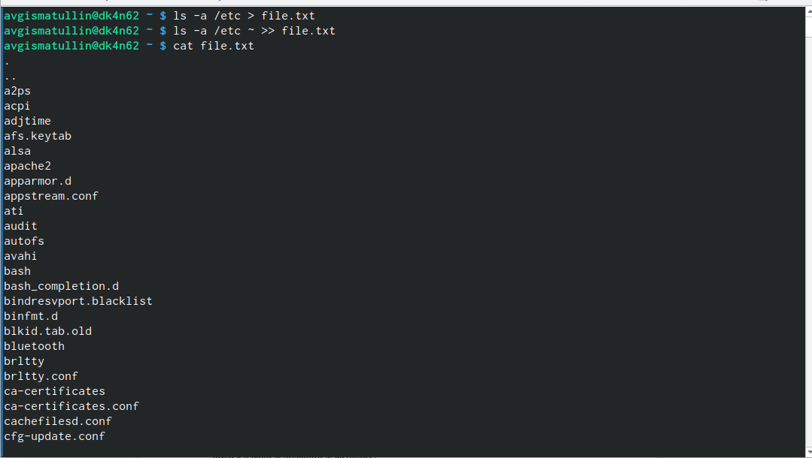
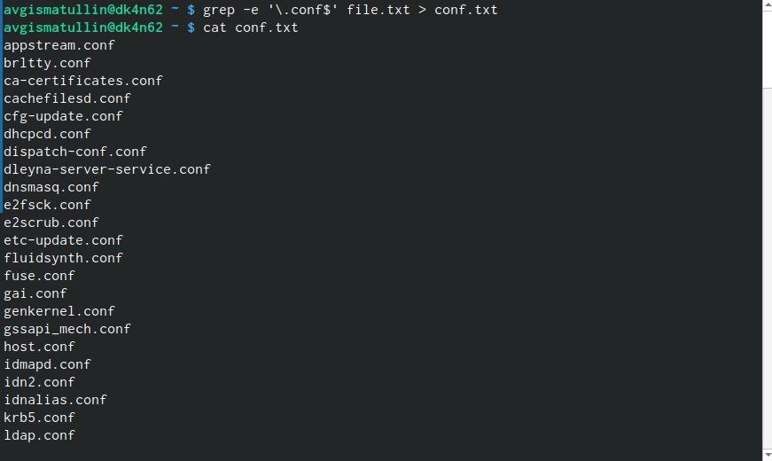
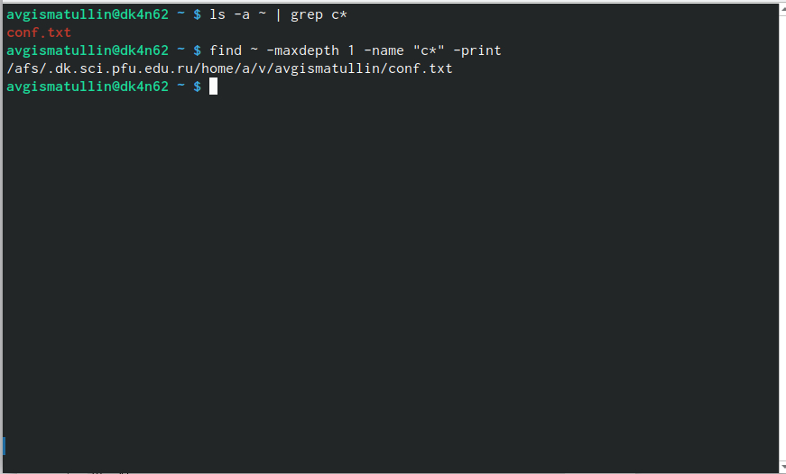
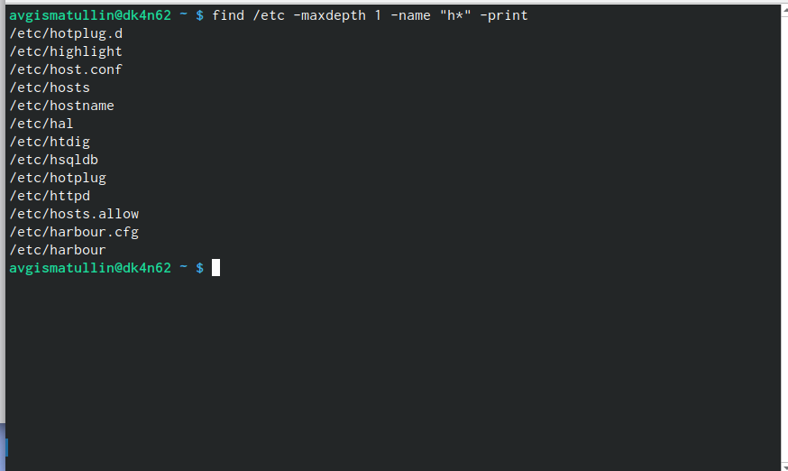
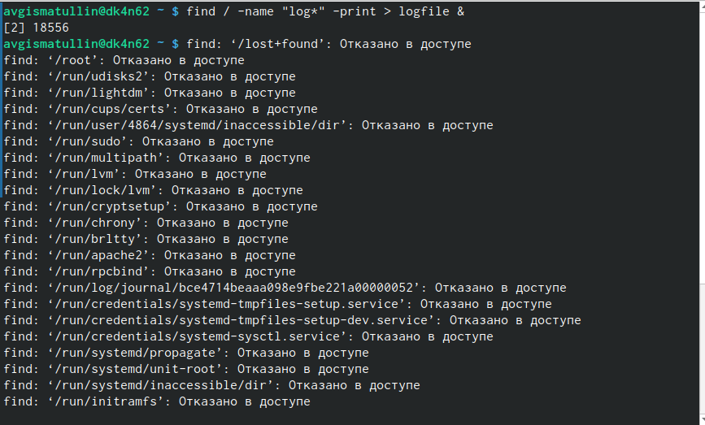
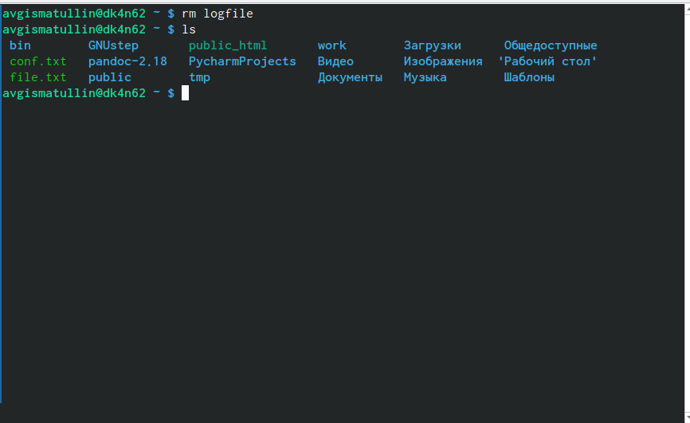
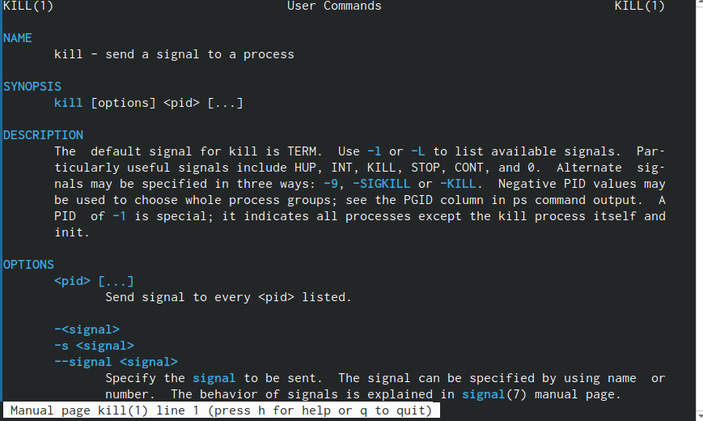
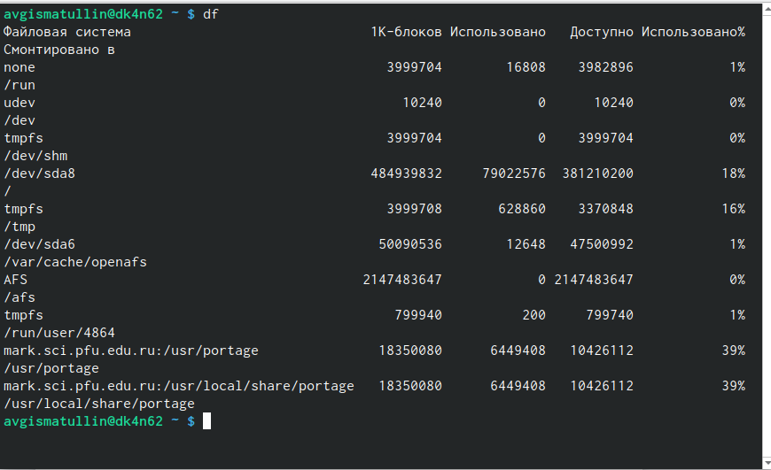
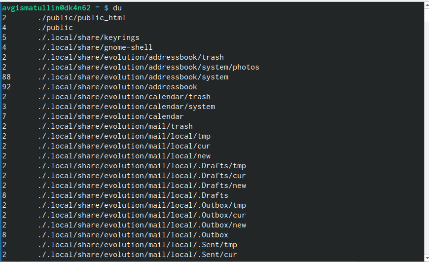
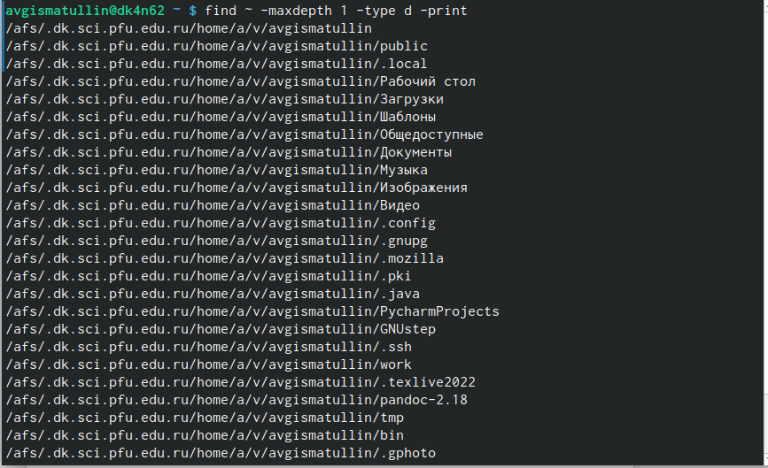

---
## Front matter
lang: ru-RU
title: Лабораторная работа № 6.
subtitle: Поиск файлов. Перенаправление ввода-вывода. Просмотр запущенных процессов
author: |
	Гисматуллин Артём Вадимович
institute: |
	RUDN, Москва, Россия
date: 2023, 17 марта

## i18n babel
babel-lang: russian
babel-otherlangs: english

## Formatting pdf
toc: false
toc-title: Содержание
slide_level: 2
aspectratio: 169
section-titles: true
theme: metropolis
header-includes:
 - \metroset{progressbar=frametitle,sectionpage=progressbar,numbering=fraction}
 - '\makeatletter'
 - '\beamer@ignorenonframefalse'
 - '\makeatother'
---

## Цели и задачи

 - Ознакомление с инструментами поиска файлов и фильтрации текстовых данных.
 
 - Приобретение практических навыков: по управлению процессами (и заданиями), по
проверке использования диска и обслуживанию файловых систем.

# Ход работы

## Запись в file.txt

{ #fig:001 width=70%, height=70% }

## Фильтр grep

{ #fig:002 width=70%, height=70% }

## Поиск по названиям 1

{ #fig:003 width=70%, height=70% }

## Поиск по названиям 2

{ #fig:004 width=70%, height=70% }

## Фоновая запись в logfile

{ #fig:005 width=70%, height=70% }

## Удаление logfile

{ #fig:006 width=70%, height=70% }

## Справка о kill

{ #fig:007 width=70%, height=70% }

## Выполнение команды df

{ #fig:011 width=70%, height=70% }

## Выполнение команды du

{ #fig:012 width=70%, height=70% }

## Результат поиска директорий. Find

{ #fig:015 width=70%, height=70% }

## Вывод

В ходе выполнения лабораторной работы мы ознакомились с инструментами поиска файлов и фильтрации текстовых данных.
Приобрели практические навыки: по управлению процессами (и заданиями), по
проверке использования диска и обслуживанию файловых систем.

## {.standout}

Спасибо за понимание!

