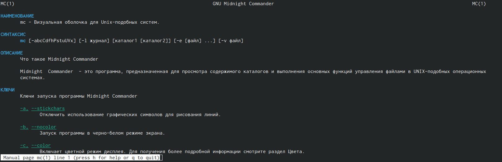
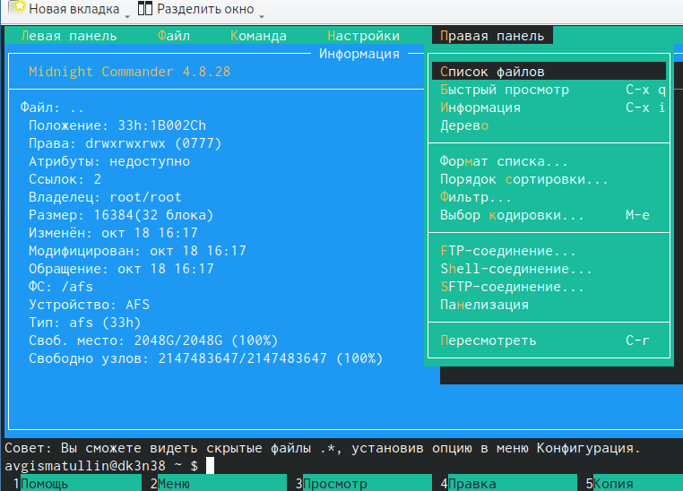
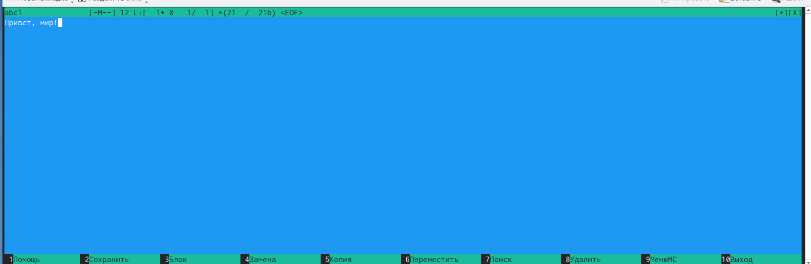
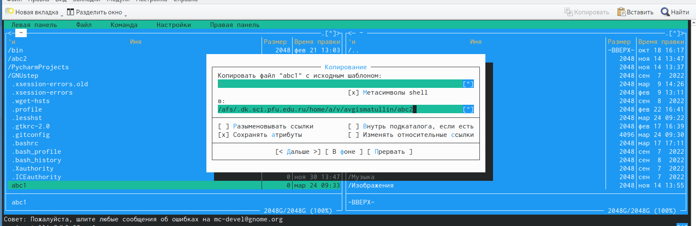
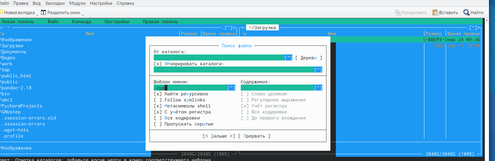
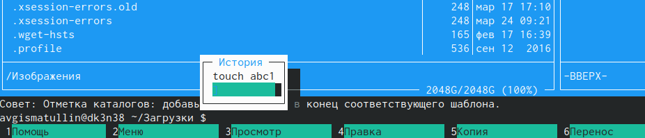
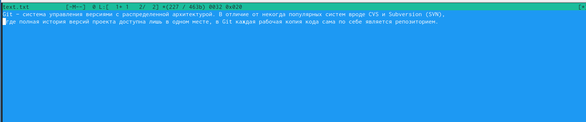
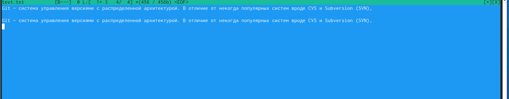
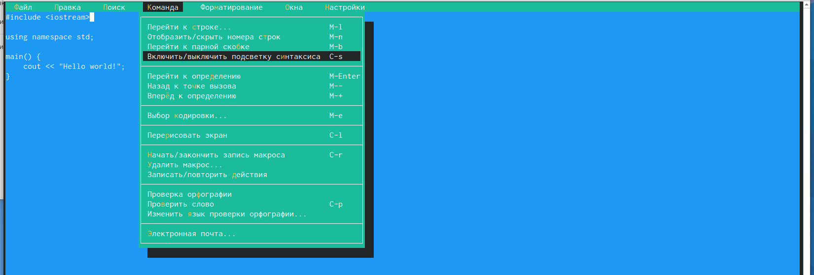

---
## Front matter
lang: ru-RU
title: Лабораторная работа № 7.
subtitle: Командная оболочка Midnight Commander
author: |
	Гисматуллин Артём Вадимович
institute: |
	RUDN, Москва, Россия
date: 2023, 24 марта

## i18n babel
babel-lang: russian
babel-otherlangs: english

## Formatting pdf
toc: false
toc-title: Содержание
slide_level: 2
aspectratio: 169
section-titles: true
theme: metropolis
header-includes:
 - \metroset{progressbar=frametitle,sectionpage=progressbar,numbering=fraction}
 - '\makeatletter'
 - '\beamer@ignorenonframefalse'
 - '\makeatother'
---

## Цели и задачи

 - Освоение основных возможностей командной оболочки Midnight Commander.
 - Приобретение навыков практической работы по просмотру каталогов и файлов; манипуляций
с ними.

# Ход работы

## Подробно о mc

{ #fig:001 width=70%, height=70% }

## Изучение структуры mc

{ #fig:002 width=70%, height=70% }

## Изменение файлов

{ #fig:005 width=70%, height=70% }

## Копирование файлов, создание каталогов

{ #fig:007 width=70%, height=70% }

## Поиск файлов 

{ #fig:009 width=70%, height=70% }

## История команд

{ #fig:010 width=70%, height=70% }

## Изменение файла text.txt

{ #fig:015 width=70%, height=70% }

## Результат выполнения команд

{ #fig:016 width=70%, height=70% }

## Включение подсветки для main.cpp

{ #fig:018 width=70%, height=70% }

## Вывод

В ходе выполнения лабораторной работы мы освоили основные возможности командной оболочки Midnight Commander. Приобрели навыки практической работы по просмотру каталогов и файлов, а также манипуляций с ними.

## {.standout}

Спасибо за понимание!

