---
## Front matter
title: "Лабораторная работа 7"
subtitle: "Командная оболочка Midnight
Commander"
author: "Гисматуллин Артём Вадимович НПИбд-01-22"

## Generic otions
lang: ru-RU
toc-title: "Содержание"

## Bibliography
bibliography: bib/cite.bib
csl: pandoc/csl/gost-r-7-0-5-2008-numeric.csl

## Pdf output format
toc: true # Table of contents
toc-depth: 2
lof: true # List of figures
lot: true # List of tables
fontsize: 12pt
linestretch: 1.5
papersize: a4
documentclass: scrreprt
## I18n polyglossia
polyglossia-lang:
  name: russian
  options:
	- spelling=modern
	- babelshorthands=true
polyglossia-otherlangs:
  name: english
## I18n babel
babel-lang: russian
babel-otherlangs: english
## Fonts
mainfont: PT Serif
romanfont: PT Serif
sansfont: PT Sans
monofont: PT Mono
mainfontoptions: Ligatures=TeX
romanfontoptions: Ligatures=TeX
sansfontoptions: Ligatures=TeX,Scale=MatchLowercase
monofontoptions: Scale=MatchLowercase,Scale=0.9
## Biblatex
biblatex: true
biblio-style: "gost-numeric"
biblatexoptions:
  - parentracker=true
  - backend=biber
  - hyperref=auto
  - language=auto
  - autolang=other*
  - citestyle=gost-numeric
## Pandoc-crossref LaTeX customization
figureTitle: "Рис."
tableTitle: "Таблица"
listingTitle: "Листинг"
lofTitle: "Список иллюстраций"
lotTitle: "Список таблиц"
lolTitle: "Листинги"
## Misc options
indent: true
header-includes:
  - \usepackage{indentfirst}
  - \usepackage{float} # keep figures where there are in the text
  - \floatplacement{figure}{H} # keep figures where there are in the text
---

# Цель работы

Освоение основных возможностей командной оболочки Midnight Commander. Приоб-
ретение навыков практической работы по просмотру каталогов и файлов; манипуляций
с ними.

# Задание

Задание по mc:

1. Изучите информацию о mc, вызвав в командной строке man mc.
2. Запустите из командной строки mc, изучите его структуру и меню.
3. Выполните несколько операций в mc, используя управляющие клавиши (операции с панелями; выделение/отмена выделения файлов, копирование/перемещение файлов, получение информации о размере и правах доступа на файлы и/или каталоги и т.п.)
4. Выполните основные команды меню левой (или правой) панели. Оцените степень подробности вывода информации о файлах.
5. Используя возможности подменю Файл, выполните:
- просмотр содержимого текстового файла;
- редактирование содержимого текстового файла (без сохранения результатов редактирования);
- создание каталога;
- копирование в файлов в созданный каталог.
6. С помощью соответствующих средств подменю Команда осуществите:
- поиск в файловой системе файла с заданными условиями (например, файла с расширением .c или .cpp, содержащего строку main);
- выбор и повторение одной из предыдущих команд;
- переход в домашний каталог;
- анализ файла меню и файла расширений.
7. Вызовите подменю Настройки . Освойте операции, определяющие структуру экрана mc (Full screen, Double Width, Show Hidden Files и т.д.)

Задание по встроенному редактору mc:

1. Создайте текстовой файл text.txt.
2. Откройте этот файл с помощью встроенного в mc редактора.
3. Вставьте в открытый файл небольшой фрагмент текста, скопированный из любого другого файла или Интернета.
4. Проделайте с текстом следующие манипуляции, используя горячие клавиши:
- Удалите строку текста.
- Выделите фрагмент текста и скопируйте его на новую строку.
- Выделите фрагмент текста и перенесите его на новую строку.
- Сохраните файл.
- Отмените последнее действие.
- Перейдите в конец файла (нажав комбинацию клавиш) и напишите некоторый текст.
- Перейдите в начало файла (нажав комбинацию клавиш) и напишите некоторый текст.
- Сохраните и закройте файл.
5. Откройте файл с исходным текстом на некотором языке программирования (например C или Java)
6. Используя меню редактора, включите подсветку синтаксиса, если она не включена, или выключите, если она включена.

# Теоретическое введение

## Midnight Commander

Midnight Commander (или просто mc) — это программа, которая позволяет просматривать структуру каталогов и выполнять основные операции по управлению файловой системой, т.е. mc является файловым менеджером. Midnight Commander позволяет сделать работу с файлами более удобной и наглядной. Вызов данной программы осуществляется с помощью команды mc в командной строке. 

## Структура программы на языке ассемблера NASM

Программа на языке ассемблера NASM, как правило, состоит из трёх секций: секция кода программы (SECTION .text), секция инициированных (известных во время компиляции) данных (SECTION .data) и секция неинициализированных данных (тех, под которые во время компиляции только отводится память, а значение присваивается в ходе выполнения программы) (SECTION .bss).

Для объявления инициированных данных в секции .data используются директивы DB, DW, DD, DQ и DT, которые резервируют память и указывают, какие значения должны храниться в этой памяти.
Директивы используются для объявления простых переменных и для объявления массивов. Для определения строк принято использовать директиву DB в связи с особенностями хранения данных в оперативной памяти.

Синтаксис директив определения данных следующий:
	<имя> DB <операнд> [, <операнд>] [, <операнд>]
	
Для объявления неинициированных данных в секции .bss используются директивы resb, resw, resd и другие, которые сообщают ассемблеру, что необходимо зарезервировать заданное количество ячеек памяти.
## Элементы программирования

### Описание инструкции mov

Инструкция языка ассемблера mov предназначена для дублирования данных источника в приёмнике. В общем виде эта инструкция записывается в виде

mov dst,src

Здесь операнд dst — приёмник, а src — источник.
В качестве операнда могут выступать регистры (register), ячейки памяти (memory) и непосредственные значения (const). 

### Описание инструкции int.

Инструкция языка ассемблера int предназначена для вызова прерывания с указанным номером. В общем виде она записывается в виде:

int n

Здесь n — номер прерывания, принадлежащий диапазону 0–255.
При программировании в Linux с использованием вызовов ядра sys_calls n=80h (принято задавать в шестнадцатеричной системе счисления).
После вызова инструкции int 80h выполняется системный вызов какой-либо функции ядра Linux. При этом происходит передача управления ядру операционной системы. Чтобы узнать, какую именно системную функцию нужно выполнить, ядро извлекает номер системного вызова из регистра eax. Поэтому перед вызовом прерывания необходимо поместить в этот регистр нужный
номер. Кроме того, многим системным функциям требуется передавать какие-либо параметры. По принятым в ОС Linux правилам эти параметры помещаются в порядке следования в остальные регистры процессора: ebx, ecx, edx. Если системная функция должна вернуть значение, то она помещает его в регистр eax.

### Cистемные вызовы для обеспечения диалога с пользователем

Простейший диалог с пользователем требует наличия двух функций — вывода текста на экран и ввода текста с клавиатуры. Простейший способ вывести строку на экран — использовать системный вызов write. Этот системный вызов имеет номер 4, поэтому перед вызовом инструкции int необходимо поместить значение 4 в регистр eax. Первым аргументом write, помещаемым в регистр ebx, задаётся дескриптор файла. Для вывода на экран в качестве дескриптора файла нужно указать 1 (это означает «стандартный вывод», т. е. вывод на экран).

Вторым аргументом задаётся адрес выводимой строки (помещаем его в регистр ecx, например, инструкцией mov ecx, msg). Строка может иметь любую длину.
Последним аргументом (т.е. в регистре edx) должна задаваться максимальная длина выводимой строки.
Для ввода строки с клавиатуры можно использовать аналогичный системный вызов read. Его аргументы – такие же, как у вызова write, только для «чтения» с клавиатуры используется файловый дескриптор 0 (стандартный ввод).

Системный вызов exit является обязательным в конце любой программы на языке ассемблер. Для обозначения конца программы перед вызовом инструкции int 80h необходимо поместить в регистр еах значение 1, а в регистр ebx код завершения 0.

# Выполнение лабораторной работы

1. Первым делом изучим документацию по mc. Для этого введем команду mc man (рис. @fig:001).

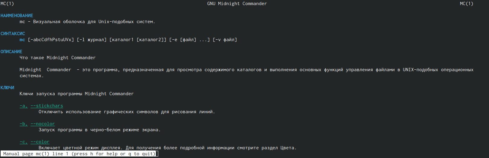{ #fig:001 width=70%, height=70% }

Эта программа помогает нам лучше перемещаться по файловой системе и редактировать сами файлы. Приступим к ее более подробному изучению.
Левая и правая панели идентичны (рис. @fig:002). Здесь мы можем получить список файлов, изучить более подробную информацию (представлена ниже левее информации о панели), так же быстрые команды позволяют ускорить работу и навигацию в mc (f2 - хранение изменений, f5 - копирование файлов и др.)

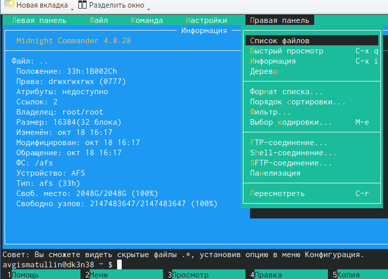{ #fig:002 width=70%, height=70% }

Далее с помощью графы Файл и соответствующих команд изучим содержимое файла abc1 (рис. @fig:003)

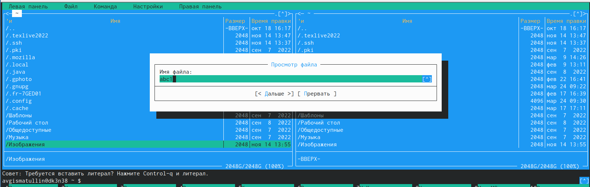{ #fig:003 width=70%, height=70% }

Как можем заметить, содержимое файла отсутствует (рис. @fig:004)

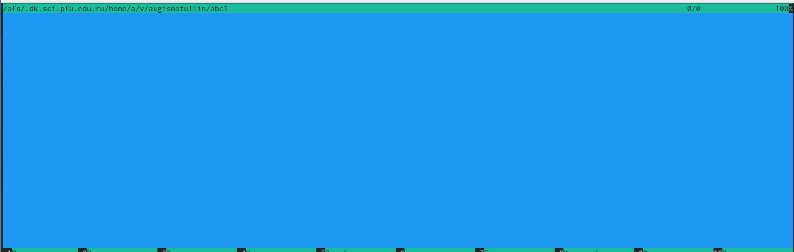{ #fig:004 width=70%, height=70% }

Так же мы можем вносить правки в файл (рис. @fig:005), создавать каталоги (рис. @fig:006), копировать файлы из одного каталога в другой (рис. @fig:007)

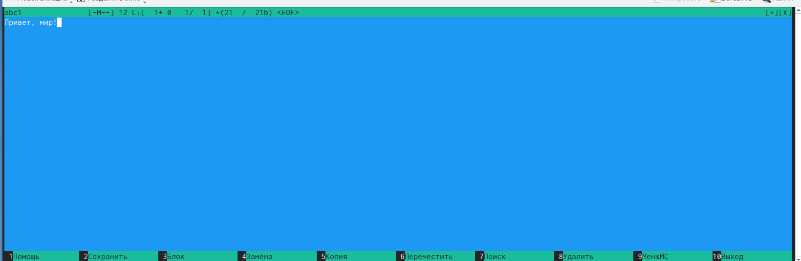{ #fig:005 width=70%, height=70% }

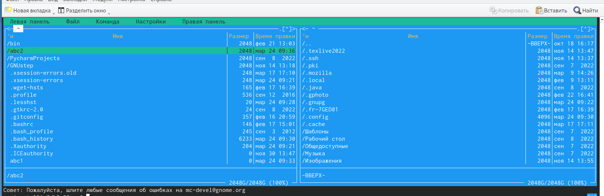{ #fig:006 width=70%, height=70% }

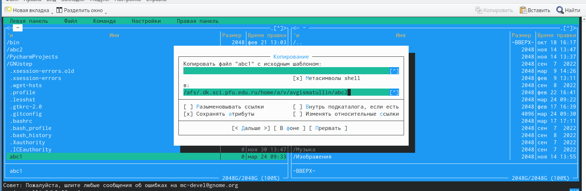{ #fig:007 width=70%, height=70% }

Последним действием мы произвели копирование файла abc1 в каталог abc2. Результат копирования (рис. @fig:008):

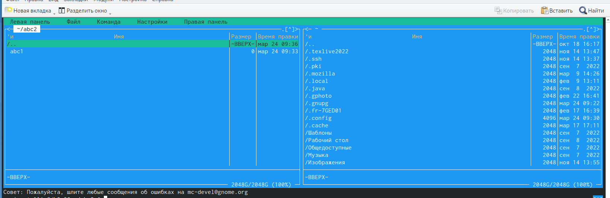{ #fig:008 width=70%, height=70% }

Более того, мы можем производить поиск по файловой системе с определенными параметрами. Например, можем искать файлы с расширением .cpp (рис. @fig:009):

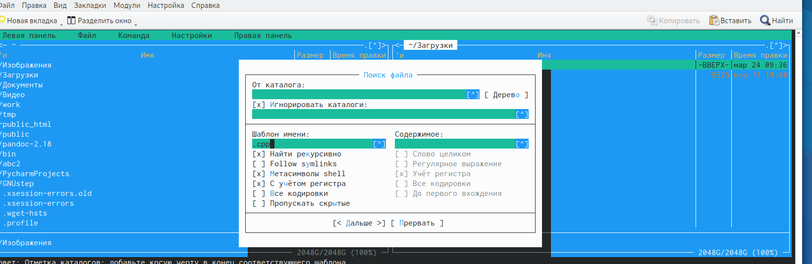{ #fig:009 width=70%, height=70% }

Изучение истории командных запросов тоже возможно. К примеру, ранее я создавал файл с названием abc1 (рис. @fig:010). Можно повторить данную команду, если ее выделить.

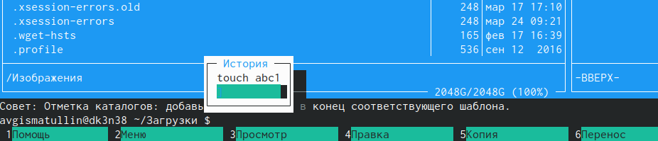{ #fig:010 width=70%, height=70% }

Наконец, перед изучением встроенного редактора проведем анализ файла меню (рис. @fig:011) и файла расширений (рис. @fig:012),

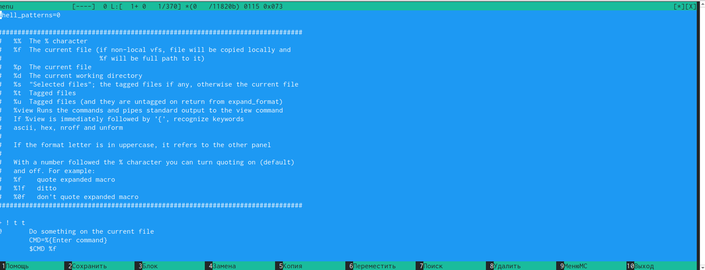{ #fig:011 width=70%, height=70% }

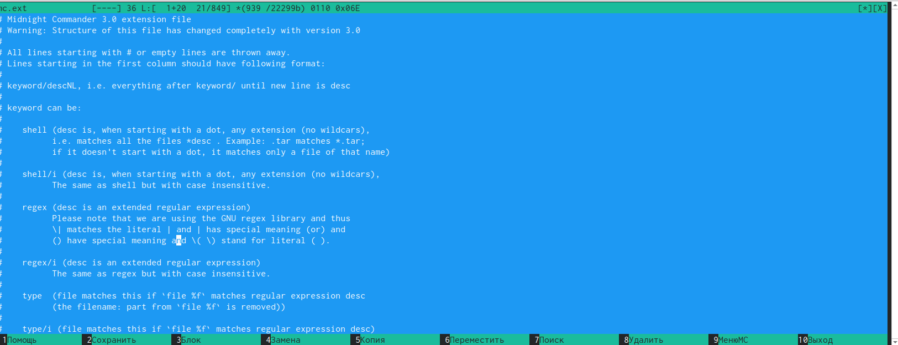{ #fig:012 width=70%, height=70% }

а затем изучим панель настроек (рис. @fig:013):

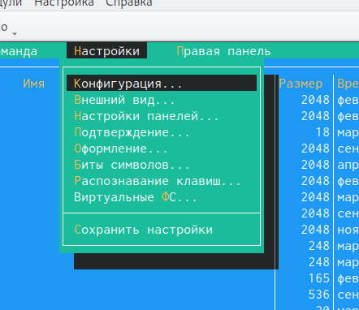{ #fig:013 width=70%, height=70% }

2. Следующим шагом будет изучение встроенного редактора mcedit. Создадим файл text.txt и перейдем к его редактированию (рис. @fig:014):

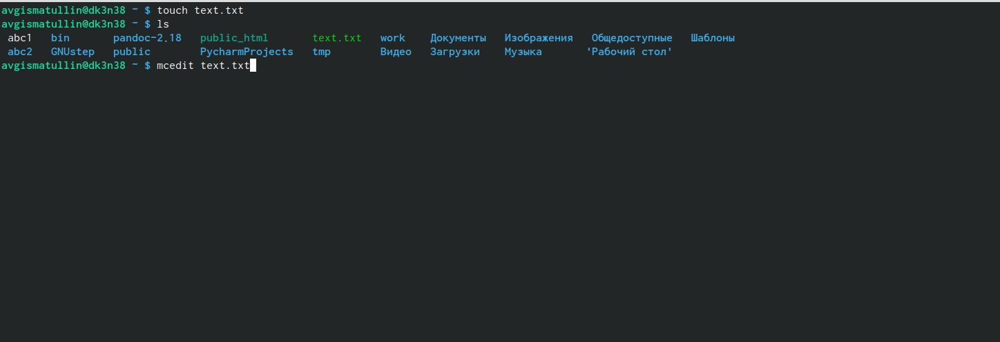{ #fig:014 width=70%, height=70% }

В этот файл внесем небольшую информацию о git (рис. @fig:015):

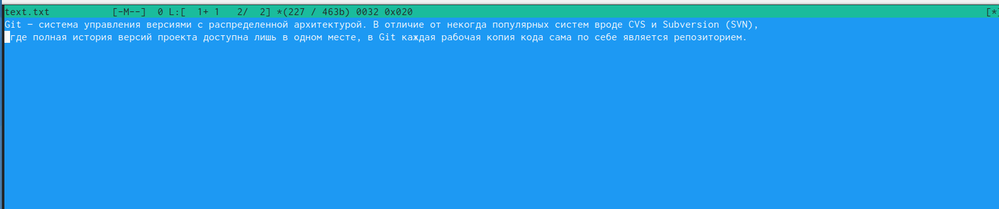{ #fig:015 width=70%, height=70% }

Проделаем с данным текстом следующие манипуляции. Для начала удалим строку текста с помощью "Ctrl-y". Выделим фрагмент текста "F3" и скопируем его на новую строку "F5". Снова выделим любой фрагмент и переместим его "F6". Сохраним файл и сразу же отменим последнее действие "Ctrl-u". Перемещаться по файлу можно с помощью "F7". В конце сохраним и закроем файл (рис. -@fig:016).

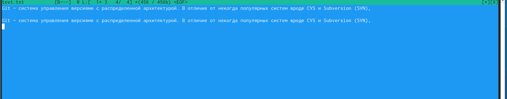{ #fig:016 width=70%, height=70% }

Затем создадим файл main.cpp (рис. -@fig:017), внесем в него программный код и выключим подсветку синтаксиса (рис. -@fig:018):

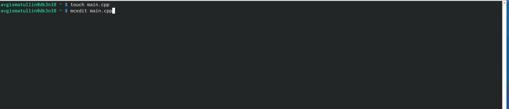{ #fig:017 width=70%, height=70% }

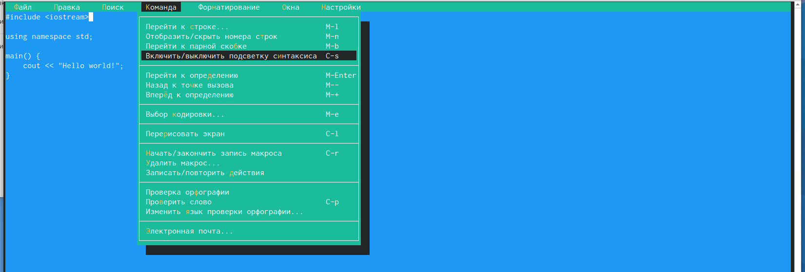{ #fig:018 width=70%, height=70% }

# Контрольные вопросы

1. Какие режимы работы есть в mc. Охарактеризуйте их.

Панели могут дополнительно быть переведены в один из двух режимов: «Информация» или «Дерево». В режиме «Информация» на панель выводятся сведения о файле и текущей файловой системе, расположенных на активной панели. В режиме «Дерево» на одной из панелей выводится структура дерева каталогов. 

2. Какие операции с файлами можно выполнить как с помощью команд shell, так и с помощью меню (комбинаций клавиш) mc? Приведите несколько примеров.

- копирование «F5» («cp имя_файла имя_каталога (в который копируем)») 
- перемещение/переименование «F6» («mv имя_файла имя_каталога (в который перемещаем)») 
- создание каталога «F7» («mkdir имя_каталога»)
- удаление «F8» («rm имя_файла»)
- изменение прав доступа «ctrl+x» («chmod u+x имя_файла»)
 
3. Опишите структура меню левой (или правой) панели mc, дайте характеристику командам.

Перейти в строку меню панелей mc можно с помощью функциональной клавиши «F9». В строке меню имеются пять меню: «Леваяпанель», «Файл», «Команда», «Настройки» и «Праваяпанель».

Под пункт меню «Быстрый просмотр» позволяет выполнить быстрый просмотр содержимого панели.

Подпункт меню «Информация» позволяет посмотреть информацию о файле или каталоге. В меню каждой (левой или правой) панели можно выбрать «Формат списка»:

- стандартный: выводит список файлов и каталогов с указанием размера и времени правки;
- ускоренный: позволяет задать число столбцов, на которые разбивается панель при выводе списка имён файлов или каталогов без дополнительной информации;
- расширенный: помимо названия файла или каталога выводит сведения о правах доступа, владельце, группе, размере, времени правки;
- определённый пользователем: позволяет вывести те сведения о файле или каталоге, которые задаст сам пользователь.

Подпункт меню «Порядок сортировки» позволяет задать критерии сортировки при выводе списка файлов и каталогов: без сортировки, по имени, расширенный, время правки, время доступа, время изменения атрибута, размер, узел. 

4. Опишите структура меню Файл mc, дайте характеристику командам.

 Команды меню «Файл»:
 
- Просмотр(«F3»): позволяет посмотреть содержимое текущего (или выделенного) файла без возможности редактирования.
- Просмотр вывода команды («М»+«!»): функция запроса команды с параметрами (аргумент к текущему выбранному файлу).
- Правка(«F4»): открывает текущий (или выделенный) файл для его редактирования.
- Копирование(«F5»): осуществляет копирование одного или нескольких файлов или каталогов в указанное пользователем во всплывающем окне место.
- Права доступа («Ctrl-x»«c»): позволяет указать (изменить) права доступа к одному или нескольким файлам или каталогам.
- Жёсткая ссылка («Ctrl-x»«l»): позволяет создать жёсткую ссылку к текущему(или выделенному) файлу.
- Символическая ссылка («Ctrl-x»«s»): позволяет создать символическую ссылку к текущему (или выделенному) файлу.
- Владелец/группа («Ctrl-x»«o»): позволяет задать (изменить) владельца и имя группы для одного или нескольких файлов или каталогов.
- Права(расширенные): позволяет изменить права доступа и владения для одного или нескольких файлов или каталогов.
- Переименование («F6»): позволяет переименовать (или переместить) один или несколько файлов или каталогов.
- Создание каталога («F7»): позволяет создать каталог.
- Удалить («F8»): позволяет удалить один или несколько файлов или каталогов.
- Выход («F10»): завершает работу mc.
 
5. Опишите структура меню Команда mc, дайте характеристику командам.

Меню Команда

В меню Команда содержатся более общие команды для работы с mc.

Команды меню Команда:

- Дерево каталогов: отображает структуру каталогов системы.
- Поиск файла: выполняет поиск файлов по заданным параметрам.
- Переставить панели: меняет местами левую и правую панели.
- Сравнить каталоги («Ctrl-x»«d»): сравнивает содержимое двух каталогов.
- Размеры каталогов: отображает размер и время изменения каталога (по умолчанию в mc размер каталога корректно не отображается).
- История командной строки: выводит на экран список ранее выполненных в оболочке команд.
- Каталоги быстрого доступа(Ctrl-»): при вызове выполняется быстрая смена текущего каталога на один из заданного списка.
- Восстановление файлов: позволяет восстановить файлы на файловых системах ext2 и ext3.
- Редактировать файл расширений: позволяет задать с
- Редактировать файл меню: позволяет отредактировать контекстное меню пользователя, вызываемое по клавише «F2».
- Редактировать файл расцветки имён: позволяет подобрать оптимальную для пользователя расцветку имён файлов в зависимости от их типа. 

6. Опишите структура меню Настройки mc, дайте характеристику командам.

Меню Настройки содержит ряд дополнительных опций по внешнему виду и функциональности mc.

Меню Настройки содержит:

- Конфигурация: позволяет скорректировать настройки работы с панелями.
- Внешний вид и Настройки панелей: определяет элементы (строка меню, командная строка, подсказки и прочее), отображаемые при вызове mc, а также геометрию расположения панелей и цветовыделение.
- Биты символов: задаёт формат обработки информации локальным терминалом.
- Подтверждение: позволяет установить или убрать вывод окна с запросом подтверждения действий при операциях удаления и перезаписи файлов, а также при выходе из программы.
- Распознание клавиш: диалоговое окно используется для тестирования функциональных клавиш, клавиш управления курсором и прочее.
- Виртуальные ФС: настройки виртуальной файловой системы: тайм-аут, пароль и прочее.
 
7. Назовите и дайте характеристику встроенным командам mc.

Функциональные клавиши mc:

- F1: вызов контекстно-зависимой подсказки
- F2: вызов пользовательского меню с возможностью создания и/или дополнения дополнительных функций
- F3: просмотр содержимого файла, на который указывает подсветка в активной панели (без возможности редактирования)
- F4: вызов встроенного в mc редактора для изменения содержания файла, на который указывает подсветка в активной панели
- F5: копирование одного или нескольких файлов, отмеченных впервой (активной) панели, в каталог, отображаемый на второй панели
- F6: перенос одного или нескольких файлов, отмеченных в первой (активной) панели, в каталог, отображаемый на второй панели
- F7: создание подкаталога в каталоге, отображаемом в активной панели
- F8: удаление одного или нескольких файлов (каталогов), отмеченных в первой (активной) панели файлов
- F9: вызов меню mc
- F10: выход из mc 

8. Назовите и дайте характеристику командам встроенного редактора mc.

Встроенный в mc редактор вызывается с помощью функциональной клавиши «F4». В нём удобно использовать различные комбинации клавиш при редактировании содержимого (как правило текстового) файла. Клавиши для редактирования файла:

- «Ctrl-y»: удалить строку
- «Ctrl-u»: отмена последней операции
- «ins»: вставка/замена
- «F7»: поиск (можно использовать регулярные выражения)
- «↑-F7»: повтор последней операции поиска
- «F4»: замена
- «F3»: первое нажатие: начало выделения, второе: окончание выделения
- «F5»: копировать выделенный фрагмент
- «F6»: переместить выделенный фрагмент
- «F8»: удалить выделенный фрагмент
- «F2»: записать изменения в файл
- «F10»: выйти из редактор 

9. Дайте характеристику средствам mc, которые позволяют создавать меню, определяемые пользователем.

Для редактирования меню пользователя, которое вызывается клавишей «F2», необходимо перейти в пункт «Редактировать файл меню» «Команда» и изменить настройки файла.
 
10. Дайте характеристику средствам mc, которые позволяют выполнять действия, определяемые пользователем, над текущим файлом.

Часть команд «Меню пользователя», а также меню «Файл» позволяют выполнять действия, определяемые пользователем, над текущим файлом. Например, копирование каталога или файла, переименование, перемещение, архивирование.

# Выводы

В ходе выполнения лабораторной работы мы освоили основные возможности командной оболочки Midnight Commander. Приобрели навыки практической работы по просмотру каталогов и файлов, а также манипуляций с ними.

# Список литературы{.unnumbered}

::: {#refs}
:::
