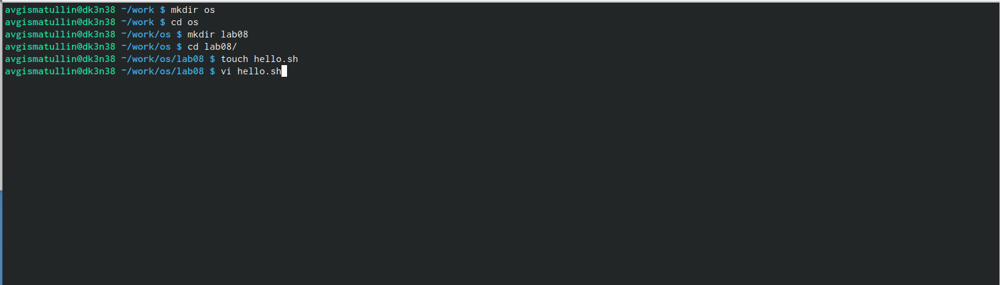
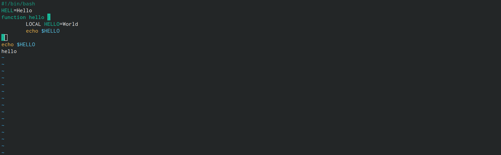
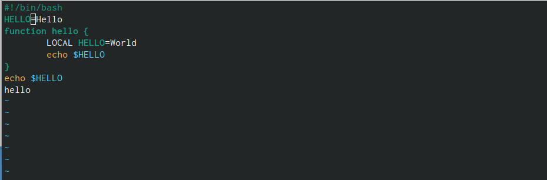
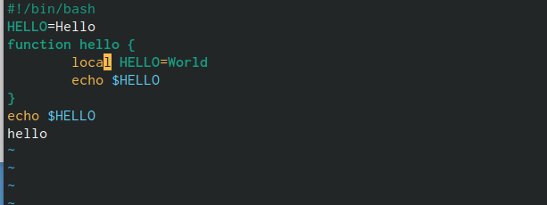
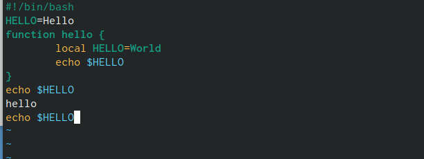
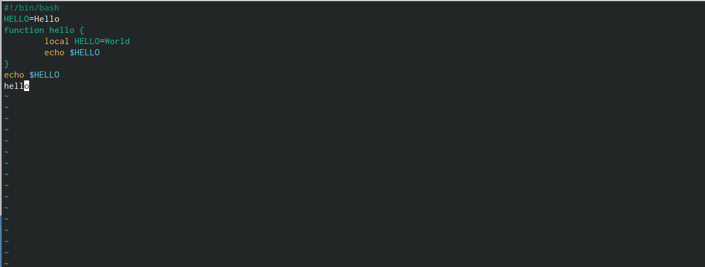
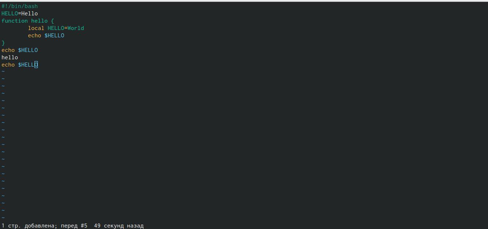

---
## Front matter
lang: ru-RU
title: Лабораторная работа № 8.
subtitle: Текстовой редактор vi
author: |
	Гисматуллин Артём Вадимович
institute: |
	RUDN, Москва, Россия
date: 2023, 24 марта

## i18n babel
babel-lang: russian
babel-otherlangs: english

## Formatting pdf
toc: false
toc-title: Содержание
slide_level: 2
aspectratio: 169
section-titles: true
theme: metropolis
header-includes:
 - \metroset{progressbar=frametitle,sectionpage=progressbar,numbering=fraction}
 - '\makeatletter'
 - '\beamer@ignorenonframefalse'
 - '\makeatother'
---

## Цели и задачи

 - Познакомиться с операционной системой Linux. 
 - Получить практические навыки работы с редактором vi, установленным по умолчанию практически во всех дистрибутивах.

# Ход работы

## Создание файла

{ #fig:001 width=70%, height=70% }

## Внесение изменений

{ #fig:002 width=70%, height=70% }

## Изменение HELL

{ #fig:005 width=70%, height=70% }

## Изменение LOCAL

{ #fig:006 width=70%, height=70% }

## Изменение последней строки

{ #fig:007 width=70%, height=70% }

## Удаление этой строки

{ #fig:008 width=70%, height=70% }

## Отмена команды

{ #fig:009 width=70%, height=70% }

## Вывод

В ходе выполнения лабораторной работы мы познакомились с операционной системой Linux и получили практические навыки работы с редактором vi, установленным по умолчанию практически во всех дистрибутивах.

## {.standout}

Спасибо за понимание!

