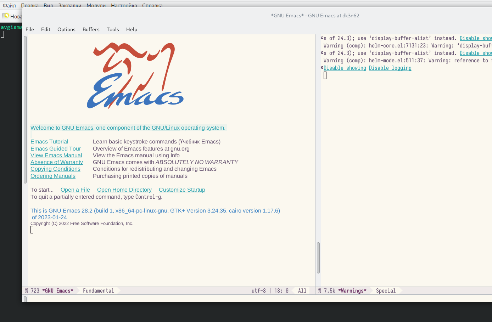
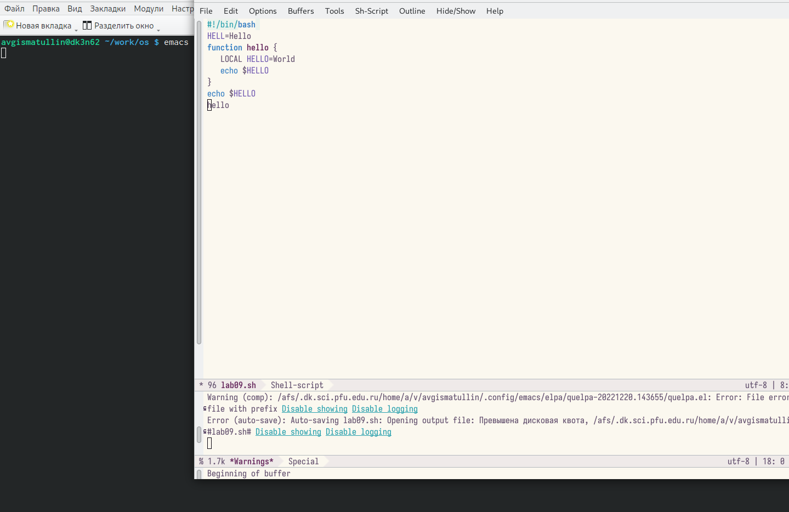
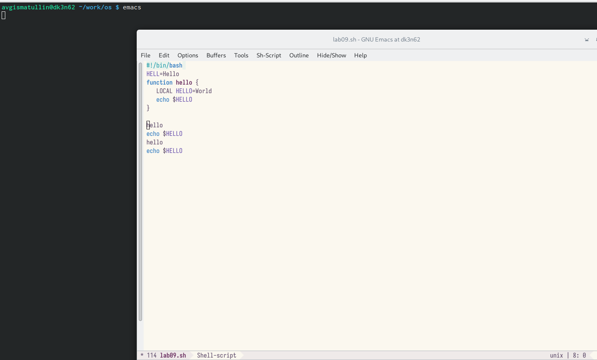
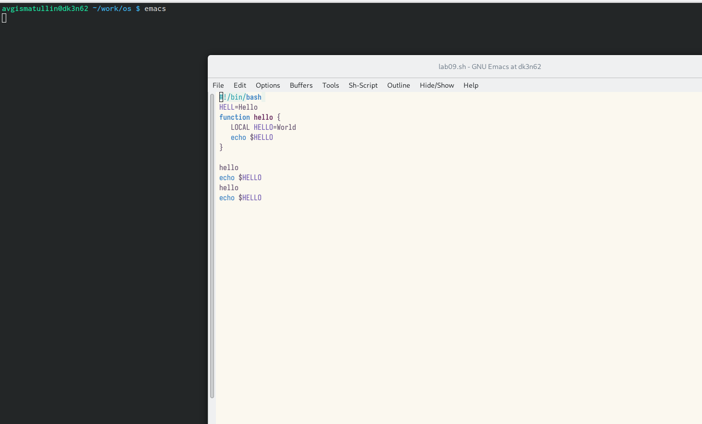
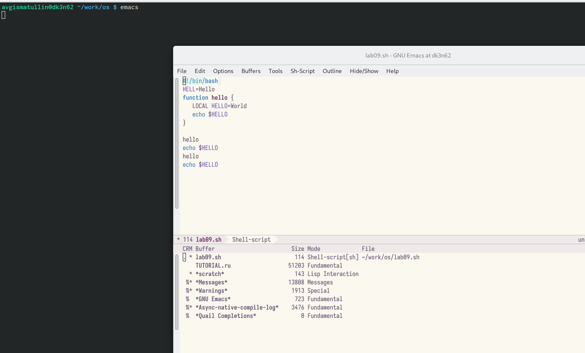
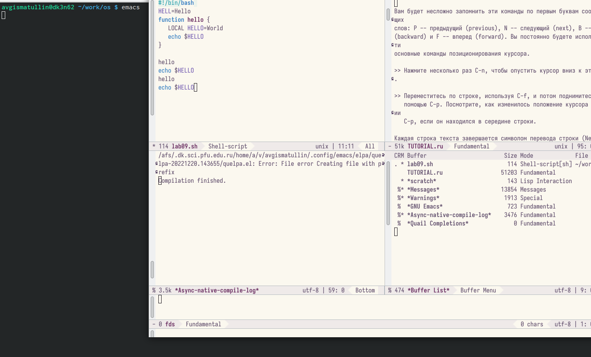
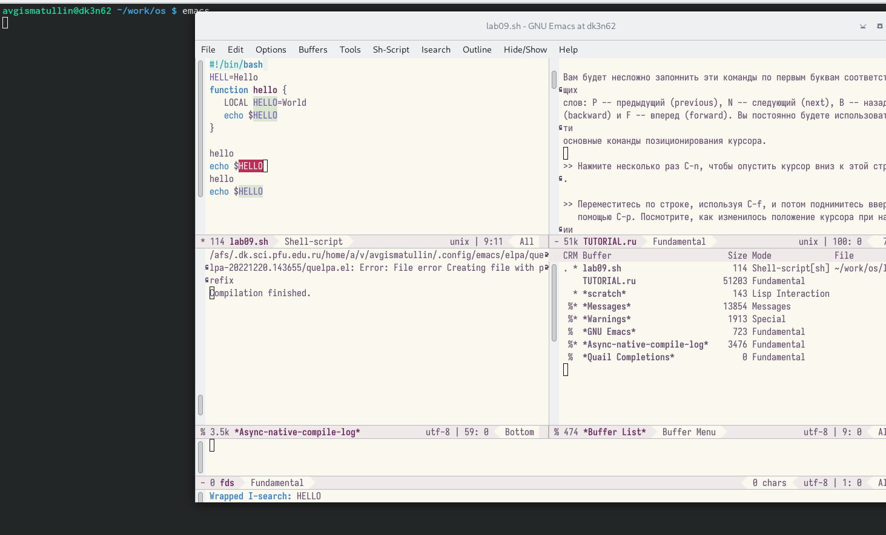
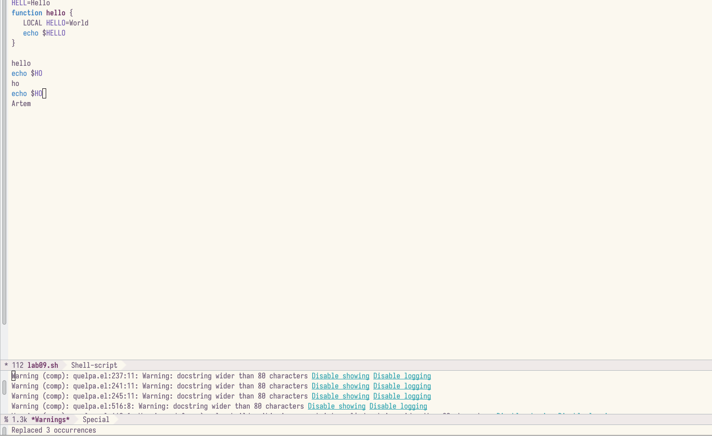
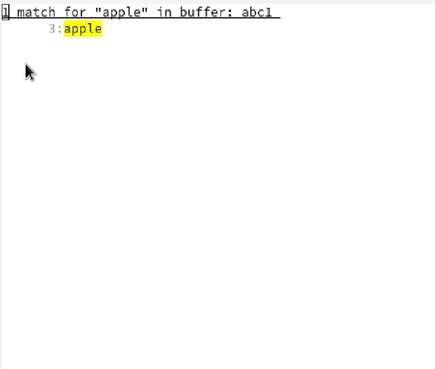

---
## Front matter
title: "Лабораторная работа №9"
subtitle: "Текстовой редактор emacs"
author: "Гисматуллин Артём Вадимович НПИбд-01-22"

## Generic otions
lang: ru-RU
toc-title: "Содержание"

## Bibliography
bibliography: bib/cite.bib
csl: pandoc/csl/gost-r-7-0-5-2008-numeric.csl

## Pdf output format
toc: true # Table of contents
toc-depth: 2
lof: true # List of figures
lot: true # List of tables
fontsize: 12pt
linestretch: 1.5
papersize: a4
documentclass: scrreprt
## I18n polyglossia
polyglossia-lang:
  name: russian
  options:
	- spelling=modern
	- babelshorthands=true
polyglossia-otherlangs:
  name: english
## I18n babel
babel-lang: russian
babel-otherlangs: english
## Fonts
mainfont: PT Serif
romanfont: PT Serif
sansfont: PT Sans
monofont: PT Mono
mainfontoptions: Ligatures=TeX
romanfontoptions: Ligatures=TeX
sansfontoptions: Ligatures=TeX,Scale=MatchLowercase
monofontoptions: Scale=MatchLowercase,Scale=0.9
## Biblatex
biblatex: true
biblio-style: "gost-numeric"
biblatexoptions:
  - parentracker=true
  - backend=biber
  - hyperref=auto
  - language=auto
  - autolang=other*
  - citestyle=gost-numeric
## Pandoc-crossref LaTeX customization
figureTitle: "Рис."
tableTitle: "Таблица"
listingTitle: "Листинг"
lofTitle: "Список иллюстраций"
lotTitle: "Список таблиц"
lolTitle: "Листинги"
## Misc options
indent: true
header-includes:
  - \usepackage{indentfirst}
  - \usepackage{float} # keep figures where there are in the text
  - \floatplacement{figure}{H} # keep figures where there are in the text
---

# Цель работы

Познакомиться с операционной системой Linux. Получить практические навыки рабо-
ты с редактором Emacs.

# Задание

1. Открыть emacs.
2. Создать файл lab09.sh с помощью комбинации Ctrl-x Ctrl-f (C-x C-f).
3. Наберите текст:

!/bin/bash

HELL=Hello

function hello {

LOCAL HELLO=World

echo $HELLO

}

echo $HELLO

hello

4. Сохранить файл с помощью комбинации Ctrl-x Ctrl-s (C-x C-s).
5. Проделать с текстом стандартные процедуры редактирования, каждое действие должно осуществляться комбинацией клавиш.
- Вырезать одной командой целую строку (С-k).
- Вставить эту строку в конец файла (C-y).
- Выделить область текста (C-space).
- Скопировать область в буфер обмена (M-w).
- Вставить область в конец файла.
- Вновь выделить эту область и на этот раз вырезать её (C-w).
- Отмените последнее действие (C-/).
6. Научитесь использовать команды по перемещению курсора.
- Переместите курсор в начало строки (C-a).
- Переместите курсор в конец строки (C-e).
- Переместите курсор в начало буфера (M-<).
- Переместите курсор в конец буфера (M->).
7. Управление буферами.
- Вывести список активных буферов на экран (C-x C-b).
- Переместитесь во вновь открытое окно (C-x) o со списком открытых буферов и переключитесь на другой буфер.
- Закройте это окно (C-x 0).
- Теперь вновь переключайтесь между буферами, но уже без вывода их списка на экран (C-x b).
8. Управление окнами.
- Поделите фрейм на 4 части: разделите фрейм на два окна по вертикали (C-x 3), а затем каждое из этих окон на две части по горизонтали (C-x 2).
- В каждом из четырёх созданных окон откройте новый буфер (файл) и введите несколько строк текста.
9. Режим поиска
- Переключитесь в режим поиска (C-s) и найдите несколько слов, присутствующих в тексте.
- Переключайтесь между результатами поиска, нажимая C-s.
- Выйдите из режима поиска, нажав C-g.
- Перейдите в режим поиска и замены (M-%), введите текст, который следует найти и заменить, нажмите Enter , затем введите текст для замены. После того как будут подсвечены результаты поиска, нажмите ! для подтверждения замены.
- Испробуйте другой режим поиска, нажав M-s o. Объясните, чем он отличается от обычного режима?

# Теоретическое введение

## Основы работы в Emacs

Для запуска Emacs необходимо в командной строке набрать emacs (или emacs & для
работы в фоновом режиме относительно консоли).

Для работы с Emacs можно использовать как элементы меню, так и различные со-
четания клавиш. Например, для выхода из Emacs можно воспользоваться меню File
и выбрать пункт Quit , а можно нажать последовательно Ctrl-x Ctrl-c (в обозначениях
Emacs: C-x C-c).

Многие рутинные операции в Emacs удобнее производить с помощью клавиатуры, а не
графического меню. Наиболее часто в командах Emacs используются сочетания c клави-
шами Ctrl и Meta (в обозначениях Emacs: C- и M-; клавиша Shift в Emasc обозначается
как S-). Так как на клавиатуре для IBM PC совместимых ПК клавиши Meta нет, то вместо
неё можно использовать Alt или Esc . Для доступа к системе меню используйте клавишу
F10 .

Клавиши Ctrl , Meta и Shift принято называть префиксными. Например, запись M-x
означает, что надо удерживая клавишу Meta (или Alt ), нажать на клавишу x. Для открытия
файла следует использовать команду C-x C-f (надо, удерживая клавишу Ctrl , нажать на
клавишу x , затем отпустить обе клавиши и снова, удерживая клавишу Ctrl , нажать на
клавишу f ).

По назначению префиксные сочетания клавиш различаются следующим образом:

– C-x — префикс ввода основных команд редактора (например, открытия, закрытии,
сохранения файла и т.д.);

– C-c — префикс вызова функций, зависящих от используемого режима

# Выполнение лабораторной работы

После ознакомления с теоретической частью откроем редактор, введя в консоль emacs (рис. @fig:001).

{ #fig:001 width=70%, height=70% }

Затем создадим файл lab09.sh командой C-x C-f и введем в него код (рис. @fig:002).

{ #fig:002 width=70%, height=70% }

Далее проделаем с текстом стандартные процедуры редактирования, причем каждое действие будет осуществляться нажатием клавиш (рис. @fig:003):
1. Вырезать одной командой целую строку (С-k).
2. Вставить эту строку в конец файла (C-y).
3. Выделить область текста (C-space).
4. Скопировать область в буфер обмена (M-w).
5. Вставить область в конец файла.
6. Вновь выделить эту область и на этот раз вырезать её (C-w).
7. Отмените последнее действие (C-/).

{ #fig:003 width=70%, height=70% }

После этого научимся командам по перемещению курсора (рис. @fig:004):

1. Переместите курсор в начало строки (C-a).
2. Переместите курсор в конец строки (C-e).
3. Переместите курсор в начало буфера (M-<).
4. Переместите курсор в конец буфера (M->).

{ #fig:004 width=70%, height=70% }

Теперь выведем список активных буферов на экран, переключимся на это окно, выйдем и переключимся между экранами без вывода списка на экран (рис. @fig:005):

{ #fig:005 width=70%, height=70% }

Следующим шагом будет деление фрейма на 4 части командами C-x 3 и C-x 2 (рис. @fig:006):

{ #fig:006 width=70%, height=70% }

Далее рассмотрим поиск по файлу. Командой C-s перейдем в режим поискаи найдем все слова HELLO в lab09.sh (рис. @fig:007):

{ #fig:007 width=70%, height=70% }

Также мы можем проводить замены в файле. Для этого введем команду M-% и заменим все HELLO на HO и посмотрим результат (рис. @fig:008):

{ #fig:008 width=70%, height=70% }

Испробуем другой режим поиска, нажав Alt-s o. Этот режим поиска отличается выводом более подробной информации, а именно выводом имени файла, в котором находится это слово и указание строки (рис. -@fig:009).

{ #fig:009 width=70%, height=70% }

# Контрольные вопросы

1. Кратко охарактеризуйте редактор emacs.

Emacs это один из наиболее мощных и широко распространённых редакторов, используемых в мире Unix. По популярности он соперничает с редактором vi и его клонами. В зависимости от ситуации, Emacs может быть текстовым редактором; программой для чтения почты и новостей Usenet; интегрированной средой разработки (IDE); операционной системой и т.д. Всё это разнообразие достигается благодаря архитектуре Emacs, которая позволяет расширять возможности редактора при помощи языка Emacs Lisp. На языке C написаны лишь самые базовые и низкоуровневые части Emacs, включая полнофункциональный. интерпретатор языка Lisp. Таким образом, Emacs имеет встроенный язык программирования, который может использоваться для настройки, расширения и изменения поведения редактора. В действительности, большая часть того редактора, с которым пользователи Emacs работают в наши дни,написана на языке Lisp. 

2. Какие особенности данного редактора могут сделать его сложным для освоения новичком?

Основную трудность для новичков при освоении данного редактора могут составлять большое количество команд, комбинаций клавиш, которые не получится все запомнить с первого раза и поэтоупридется часто обращаться к справочным материалам. 

3. Своими словами опишите, что такое буфер и окно в терминологии emacs’а.

Буфер–это объект, представляющий собой текст. Если имеется несколько буферов, то редактировать можно только один. Обычно буфер считывает данные из файла или записывает в файл данные из буфера. Окно–это область экрана, отображающая буфер. При запуске редактора отображается одно окно, но при обращении к некоторым функциям могут открыться дополнительные окна. Окна Emacsи окна графической среды XWindow–разные вещи. Одно окно XWindowможет быть разбито на несколько окон в смысле Emacs, в каждом из которых отображается отдельный буфер. 

4. Можно ли открыть больше 10 буферов в одном окне?

Да, можно. 

5. Какие буферы создаются по умолчанию при запуске emacs?

При запуске Emacsпо умолчанию создаются следующие буферы: «scratch»(буфер для несохраненного текста) «Messages»(журнал ошибок, включающий такжеинформацию, которая появляется в области EchoArea) «GNUEmacs»(справочный буфер о редакторе). 

6. Какие клавиши вы нажмёте, чтобы ввести следующую комбинацию C-c | и C-c C-|?

C-c |сначала, удерживая «ctrl»,нажимаю «c»,после –отпускаюобе клавишии нажимаю «|» C-cC-|сначала, удерживая «ctrl»,нажимаю «с», после –отпускаю обе клавиши и, удерживая «ctrl», нажимаю «|». 

7. Как поделить текущее окно на две части?

Чтобы поделить окно на две части необходимо воспользоваться комбинацией «Ctrl-x 3»(по вертикали) или «Ctrl-x 2» (по горизонтали). 

8. В каком файле хранятся настройки редактора emacs?

Настройки Emacsхранятся в файле .emacs. 

9. Какую функцию выполняет клавиша и можно ли её переназначить?

По умолчанию клавиша «←» удаляет символперед курсором, нов редакторе её можно переназначить. Для этого необхдимоизменить конфигурацию файла .emacs. 

10. Какой редактор вам показался удобнее в работе vi или emacs? Поясните почему.

Более удобным я считаю редактор emacs, потому чтов нем проще открывать другие файлы, можно использовать сразу несколько окон, нет «Командногорежима», «Режима ввода», «Режима командной строки», которые являются немного непривычными и в какой-то степени неудобным.

# Выводы

В ходе выполнения лабораторной работы мы познакомились с операционной системой Linux и получили практические навыки работы с редактором Emacs.

# Список литературы{.unnumbered}

::: {#refs}
:::
