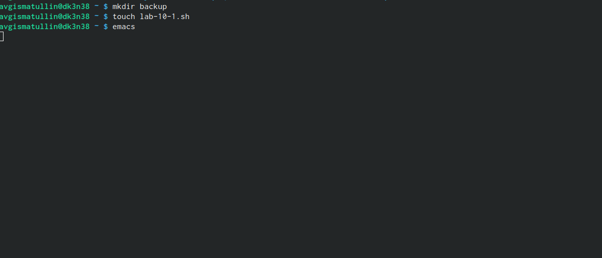
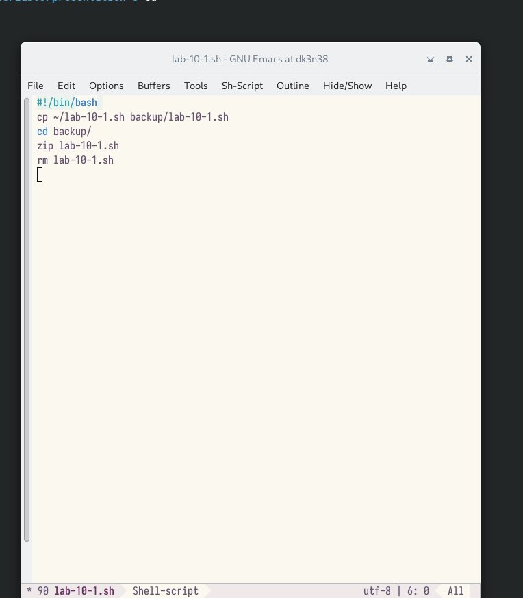
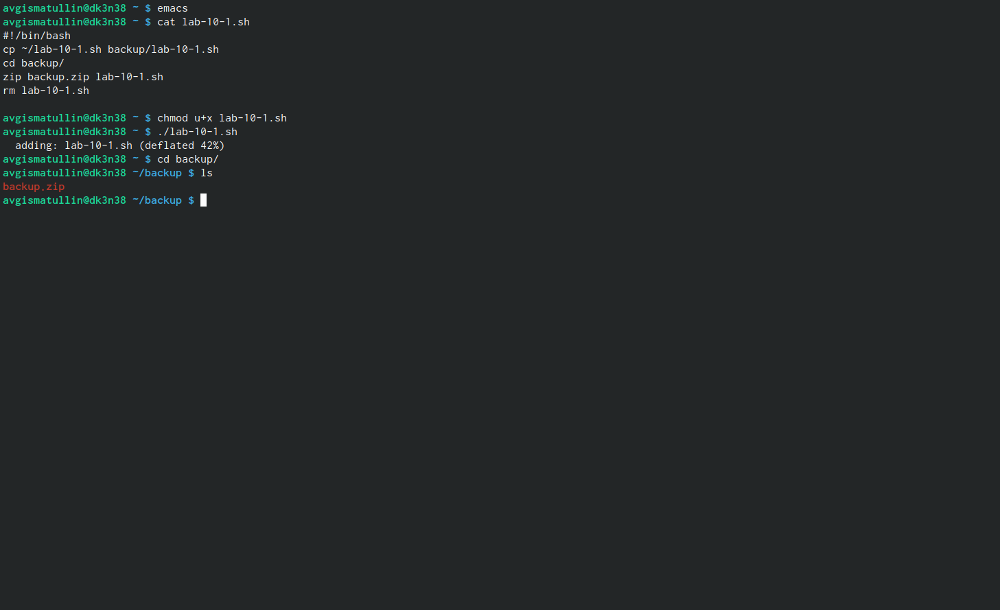
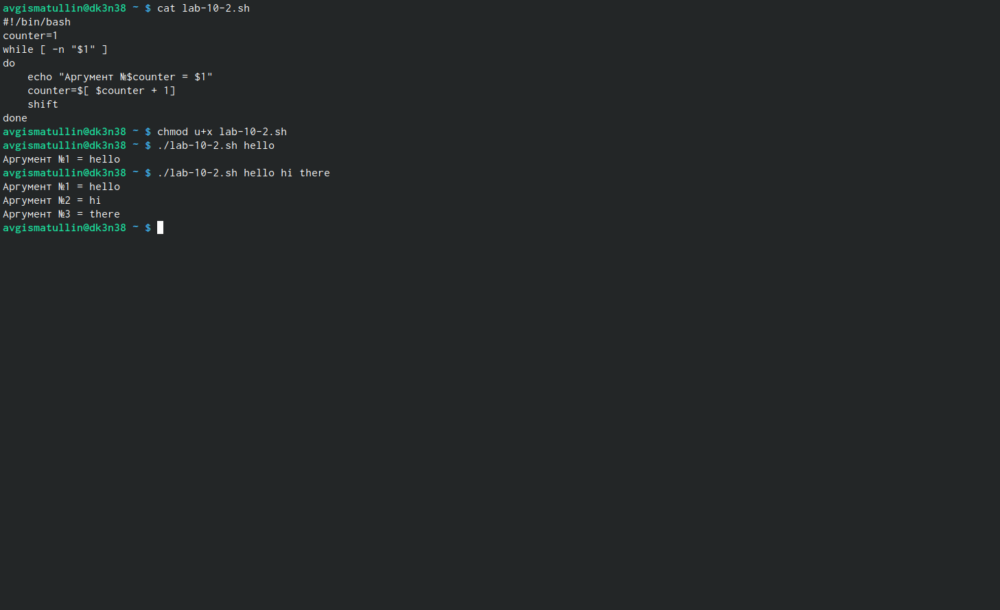
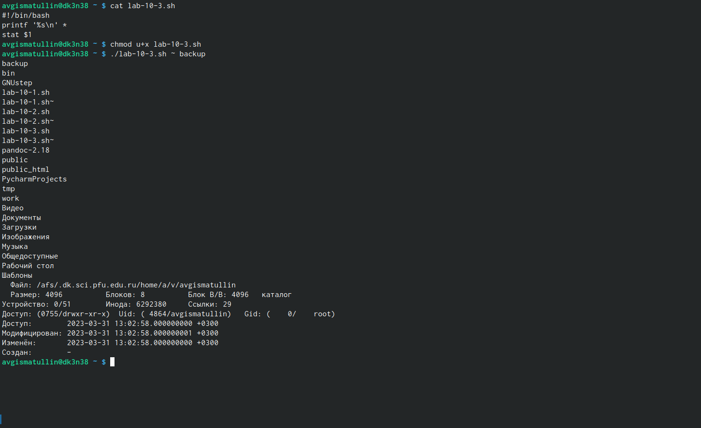
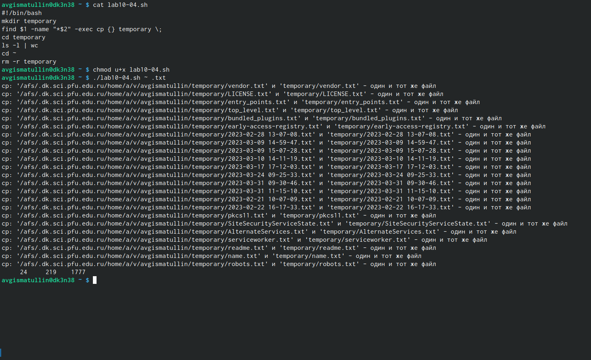

---
## Front matter
lang: ru-RU
title: Лабораторная работа № 10.
subtitle: Программирование в командном процессоре ОС UNIX
author: |
	Гисматуллин Артём Вадимович
institute: |
	RUDN, Москва, Россия
date: 2023, 14 апреля

## i18n babel
babel-lang: russian
babel-otherlangs: english

## Formatting pdf
toc: false
toc-title: Содержание
slide_level: 2
aspectratio: 169
section-titles: true
theme: metropolis
header-includes:
 - \metroset{progressbar=frametitle,sectionpage=progressbar,numbering=fraction}
 - '\makeatletter'
 - '\beamer@ignorenonframefalse'
 - '\makeatother'
---

## Цели и задачи

 - Изучить основы программирования в оболочке ОС UNIX/Linux. 
 - Научиться писать небольшие командные файлы.
 
# Ход работы

## Создание файлов

{#fig:001 width=70%, height=70%}

## Первый скрипт

{#fig:002 width=70%, height=70%}

## Исполнение первого скрипта

{#fig:003 width=70%, height=70%}

## Второй скрипт

{#fig:004 width=70%, height=70%}

## Третий скрипт

{#fig:005 width=70%, height=70%}
 
## Четвертый скрипт

{#fig:006 width=70%, height=70%}

## Вывод

В ходе выполнения лабораторной работы мы изучили основы программирования в оболочке ОС UNIX/Linux и научились писать небольшие командные файлы.

## {.standout}

Спасибо за понимание!

