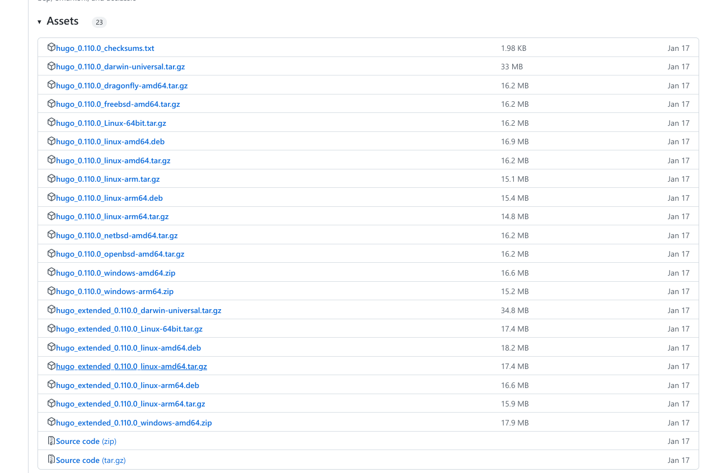
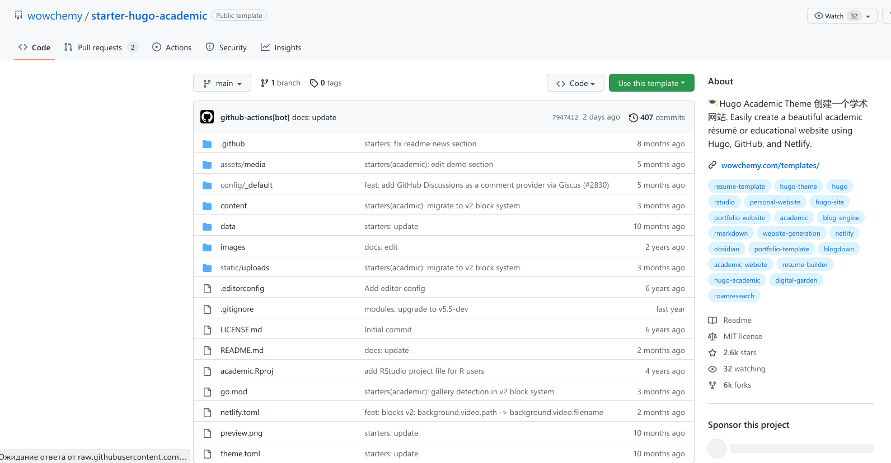
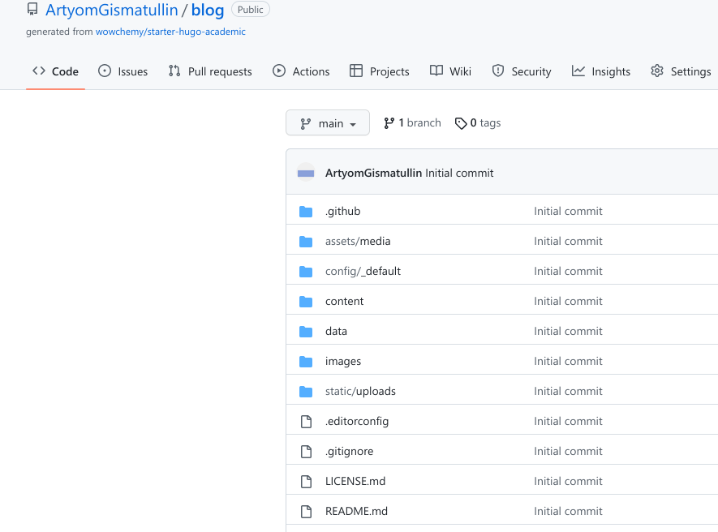
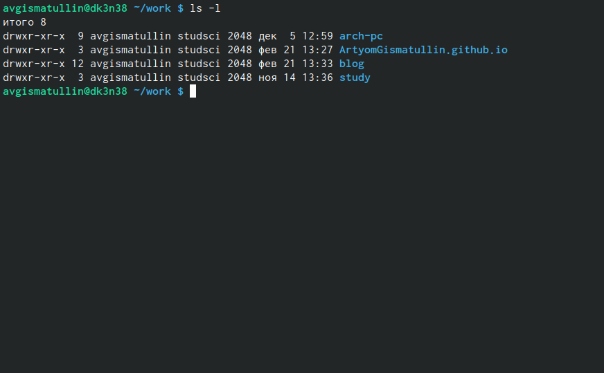
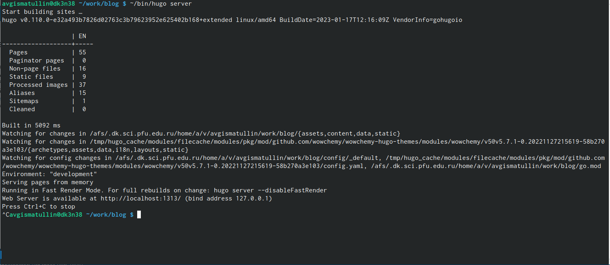
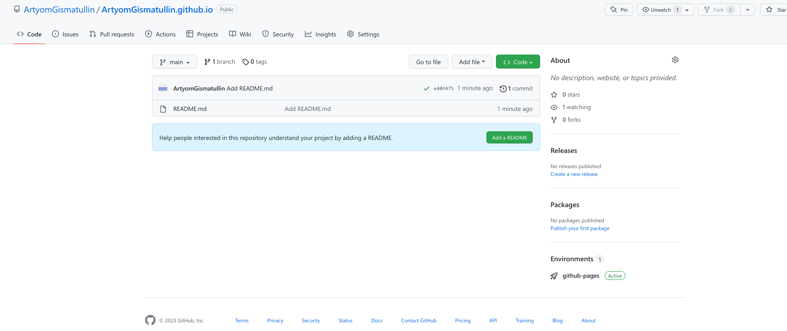
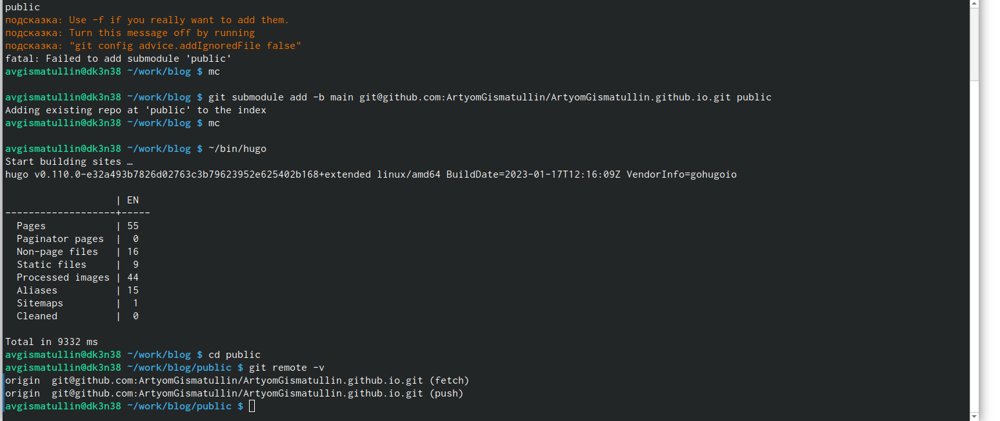
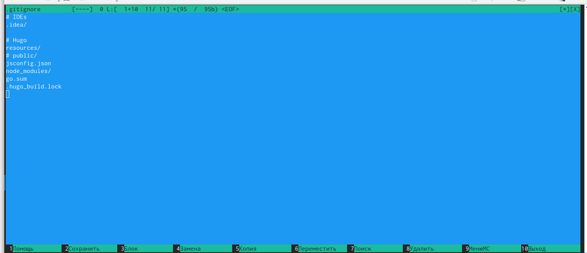
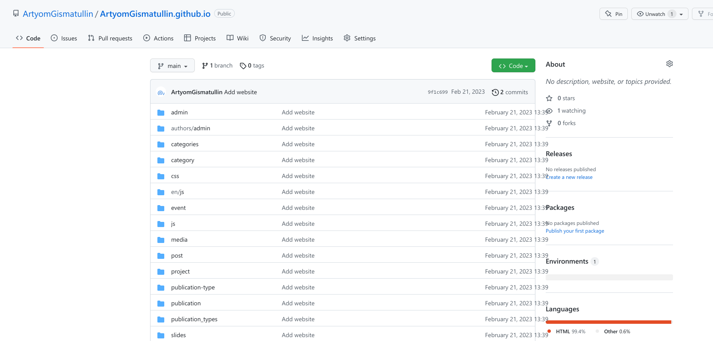
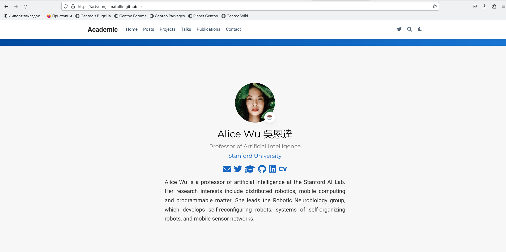

---
## Front matter
lang: ru-RU
title: Первый этап индивидуального проекта.
author: |
	Гисматуллин Артём Вадимович
institute: |
	RUDN, Москва, Россия
date: 2023, 21 февраля

## Formatting
toc: false
slide_level: 2
theme: metropolis
header-includes: 
 - \metroset{progressbar=frametitle,sectionpage=progressbar,numbering=fraction}
 - '\makeatletter'
 - '\beamer@ignorenonframefalse'
 - '\makeatother'
aspectratio: 43
section-titles: true
---

# Выполнение первого этапа индивидуального проекта

## Исполняемый файл "hugo"

Сайт: https://github.com/gohugoio/hugo/releases

Архив: hugo_extended_0.110.0_Linux-64bit.tar.gz

{ #fig:001 width=70% }

## Шаблон Hugo Academic Theme

{ #fig:002 width=70% }

## Создание нового репозитория "blog"

{ #fig:003 width=70% }

## Клонирование

{ #fig:004 width=60% }

1. В терминале переходим в каталог "work"
2. Клонируем репозиторий
3. Переходим в новый каталог "blog"

## "~/bin/hugo".Запуск сервера

{ #fig:005 width=100% }

## Демонстрация работоспособности

{#fig:006 width=70%, height=70%}

## Создание репозитория со специальным названием

Специальное название: ArtyomGismatullin.github.io

{ #fig:008 width=100% }

## Попытка подключения каталога к новому репозиторию

1. Переходим в каталог "blog"
2. Выполняем команду для подключения
3. Проверяем подключение этого каталога к репозиторию

{ #fig:011 width=100% }

## Комментирование "public"

1. Запускаем команду "mc" и переходим в ".gitignore"
2. Комментируем "public"

{ #fig:010 width=70% }

## Обновление страницы репозитория на github

{ #fig:012 width=100% }

## Новый сайт

{ #fig:013 width=100% }

# Выводы

В ходе выполнения первого этапа индивидуального проекта мы научились размещать на Github pages заготовки для персонального сайта.

## {.standout}

Спасибо за понимание!
