---
## Front matter
title: "Индивидуальный проект"
subtitle: "Размещение на Github pages заготовки для персонального сайта"
author: "Гисматуллин Артём Вадимович НПИбд-01-22"

## Generic otions
lang: ru-RU
toc-title: "Содержание"

## Bibliography
bibliography: bib/cite.bib
csl: pandoc/csl/gost-r-7-0-5-2008-numeric.csl

## Pdf output format
toc: true # Table of contents
toc-depth: 2
lof: true # List of figures
lot: true # List of tables
fontsize: 12pt
linestretch: 1.5
papersize: a4
documentclass: scrreprt
## I18n polyglossia
polyglossia-lang:
  name: russian
  options:
	- spelling=modern
	- babelshorthands=true
polyglossia-otherlangs:
  name: english
## I18n babel
babel-lang: russian
babel-otherlangs: english
## Fonts
mainfont: PT Serif
romanfont: PT Serif
sansfont: PT Sans
monofont: PT Mono
mainfontoptions: Ligatures=TeX
romanfontoptions: Ligatures=TeX
sansfontoptions: Ligatures=TeX,Scale=MatchLowercase
monofontoptions: Scale=MatchLowercase,Scale=0.9
## Biblatex
biblatex: true
biblio-style: "gost-numeric"
biblatexoptions:
  - parentracker=true
  - backend=biber
  - hyperref=auto
  - language=auto
  - autolang=other*
  - citestyle=gost-numeric
## Pandoc-crossref LaTeX customization
figureTitle: "Рис."
tableTitle: "Таблица"
listingTitle: "Листинг"
lofTitle: "Список иллюстраций"
lotTitle: "Список таблиц"
lolTitle: "Листинги"
## Misc options
indent: true
header-includes:
  - \usepackage{indentfirst}
  - \usepackage{float} # keep figures where there are in the text
  - \floatplacement{figure}{H} # keep figures where there are in the text
---

# Цель работы

Научиться создавать заготовку сайта для дальнейшй работы с ней.

# Задание

1. Установить необходимое программное обеспечение.

2. Скачать шаблон темы сайта.

3. Разместить его на хостинге git.

4. Разместить заготовку сайти на Github pages.

# Выполнение лабораторной работы

1. Для реализации сайта используем генератор статических сайтов Hugo. Скачаем архив и распакуем его (рис. @fig:001):

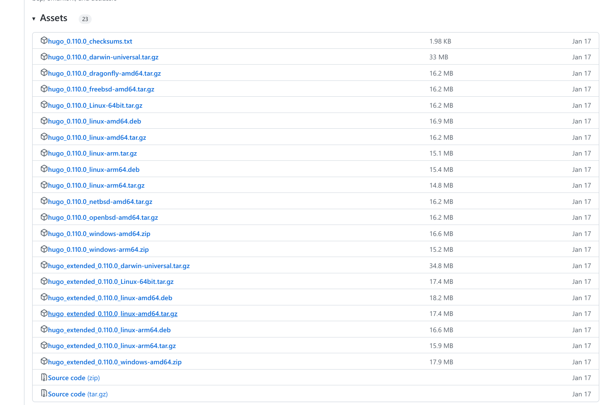{#fig:001 width=70%, height=70%}

2. Далее клонируем шаблон Hugo Academic Theme, который послужит нам основой будущего индивидуального сайта (рис. @fig:002). Назовем его blog (рис. @fig:003).

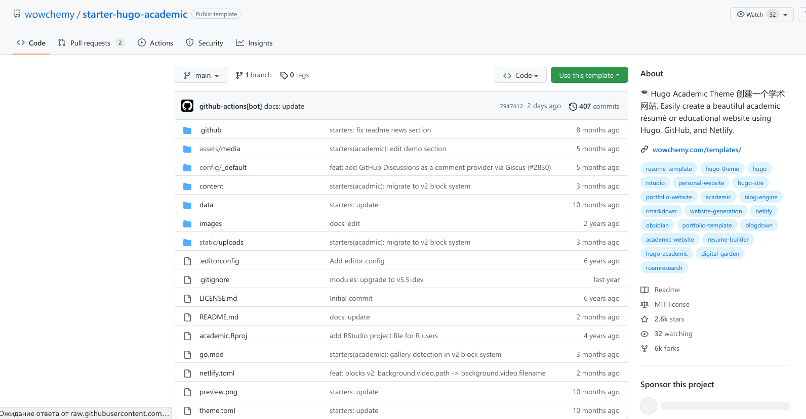{#fig:002 width=70%, height=70%}

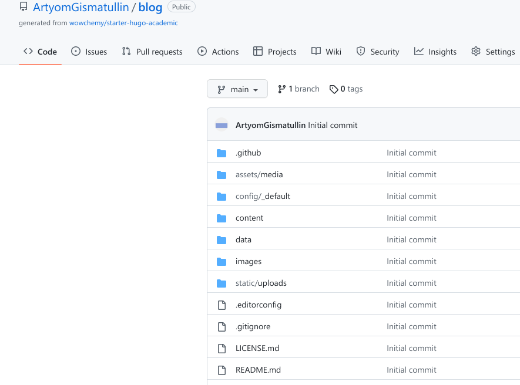{#fig:003 width=70%, height=70%}

C помощью команды git clone --recursive клонируем этот репозиторий на локальную машину на уровне с другими учебными проектами. В результате имеем (рис. @fig:004):

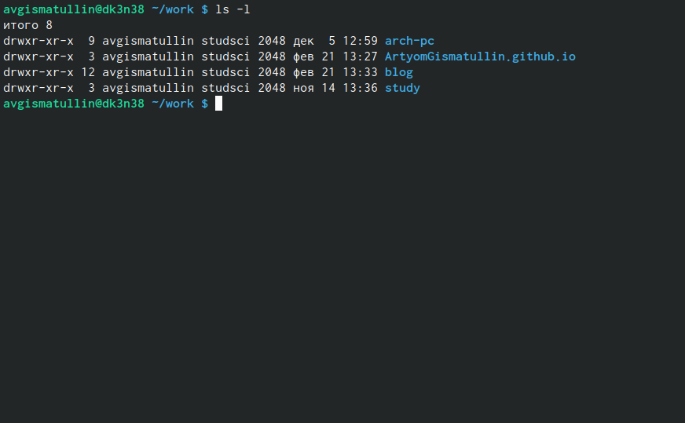{#fig:004 width=70%, height=70%}

Если попытаться запустить наш сайт, то здесь понадобится генератор статических сайтов hugo, который я разместил по адресу ~/bin/hugo. Командой сервер (рис. @fig:005) мы с локальной машины запустили его, перейдем по ссылке (рис. @fig:006):

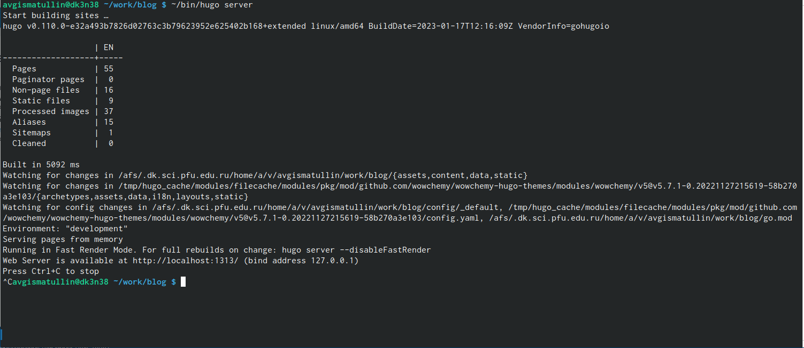{#fig:005 width=70%, height=70%}

{#fig:006 width=70%, height=70%}

Пока мы здесь видим лишь заготовку, в дальнейшем мы будем его конструировать таким образом, что это станет нашим персональным сайтом.

3. Следующим этапом будет работа над тем, чтобы мы имели возможность запускать сайт не только с локальной машины. Для этого создадим репозиторий с названием ArtyomGismatullin.github.io и клонируем его себе на компьютер (рис. @fig:007).

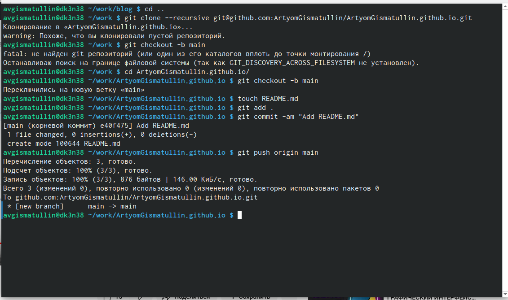{#fig:007 width=70%, height=70%}

Здесь же мы видим, что был создан файл README.md, чтобы репозиторий не был пустым, а также сделали его основным в ветке. В результате имеем следующее (рис. @fig:008):

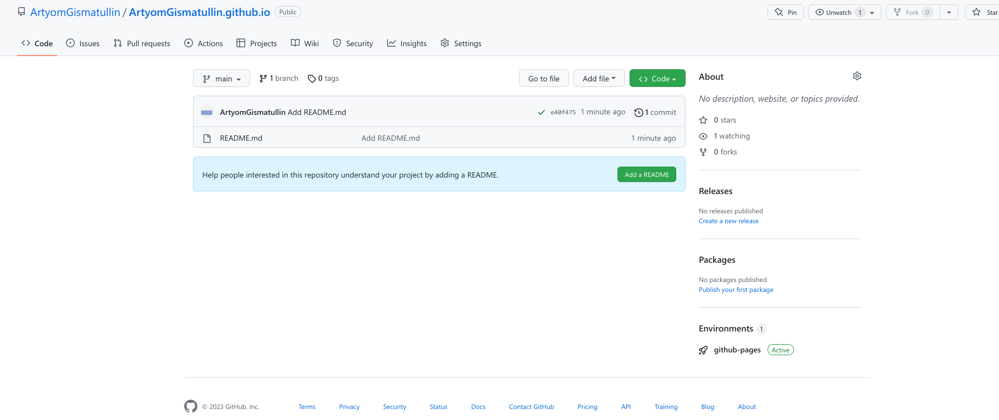{#fig:008 width=70%, height=70%}

После этого связываем наш репозиторий с шаблоном сайта с новым, только что созданным (рис. @fig:009):

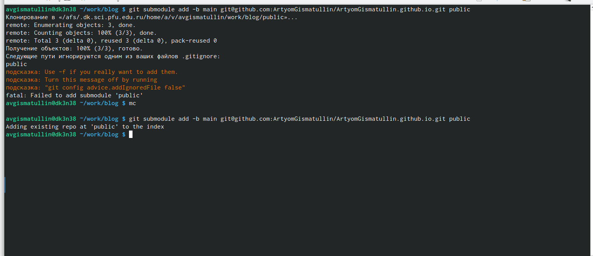{#fig:009 width=70%, height=70%}

Можем заметить, что в файле .gitignore прописан путь /public, а именно посредством этой директории мы хотим связать наши репозитории. Внесем изменения в .gitignore и повторим команду (рис. @fig:010).

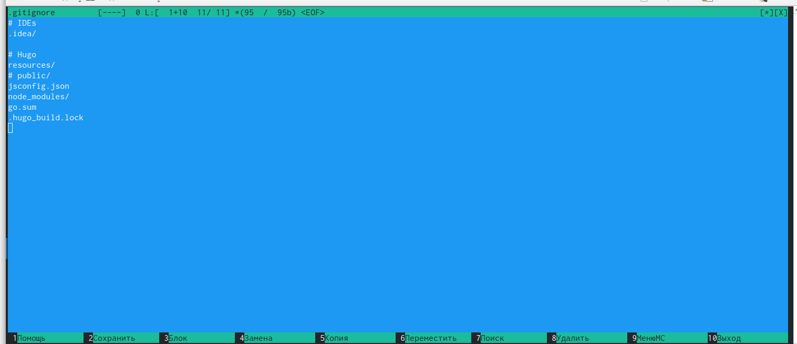{#fig:010 width=70%, height=70%}

Затем проверим связь репозиториев в директории ../public. (рис. @fig:011) Внесем изменения (рис. @fig:012) и проверим работоспособность (рис. @fig:013). 

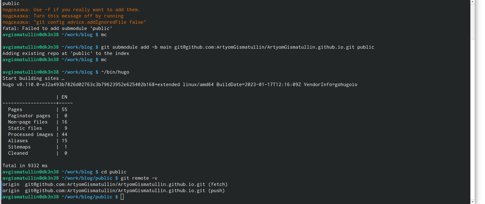{#fig:011 width=70%, height=70%}

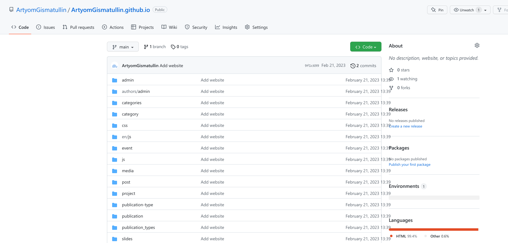{#fig:012 width=70%, height=70%}

{#fig:013 width=70%, height=70%}

На последнем изображении можем заметить, что ссылка теперь общедоступна. Теперь это наш фундамент будущего персонального сайта.

# Выводы

В ходе работы я научился создавать заготовку сайта и размещать ее в открытый доступ.

# Список литературы{.unnumbered}

::: {#refs}
:::
