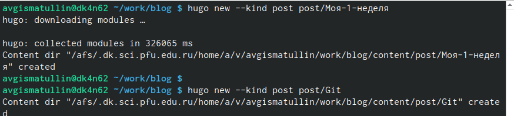

---
## Front matter
lang: ru-RU
title: Второй этап индвидуального проекта.
subtitle: Информация о себе
author: |
	Гисматуллин Артём Вадимович
institute: |
	RUDN, Москва, Россия
date: 2023, 17 марта

## i18n babel
babel-lang: russian
babel-otherlangs: english

## Formatting pdf
toc: false
toc-title: Содержание
slide_level: 2
aspectratio: 169
section-titles: true
theme: metropolis
header-includes:
 - \metroset{progressbar=frametitle,sectionpage=progressbar,numbering=fraction}
 - '\makeatletter'
 - '\beamer@ignorenonframefalse'
 - '\makeatother'
---

## Цели и задачи

 - Добавить к сайту данные о себе.
 
 - Создать пост о прошедшей неделе, а также о git

# Ход работы

## Добавление фото

{ #fig:001 width=100% }

## Информация о себе

{ #fig:002 width=100% }

## Создание постов

{ #fig:003 width=100% }

## В файловой системе:

{ #fig:004 width=100% }

## о Git

{ #fig:005 width=100% }

## Выгрузка на сайт

{ #fig:006 width=100% }

## Сохранение изменений

{ #fig:008 width=100% }

## Информация о себе

{ #fig:008 width=100% }

## Посты

{ #fig:009 width=100% }

## Вывод

В ходе выполнения второго этапа индивидуального проекта мы научились добавлять к сайту информацию о себе, а также создавать новые посты.

## {.standout}

Спасибо за понимание!

